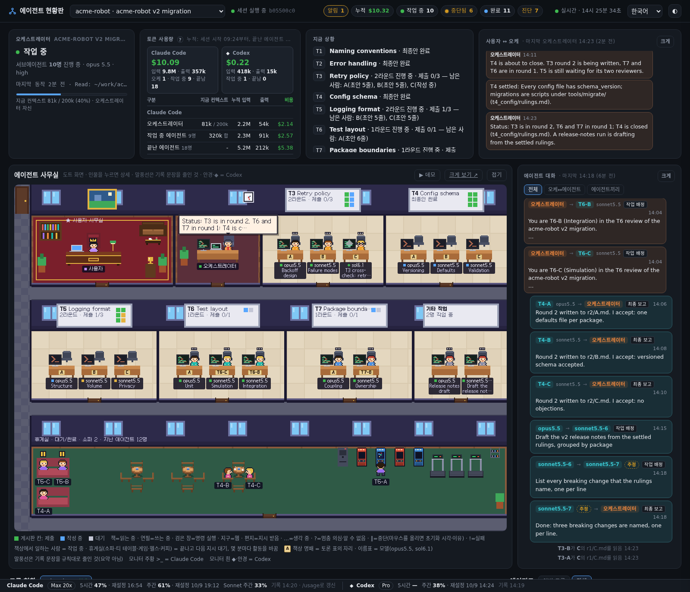
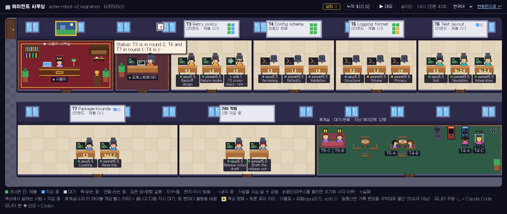
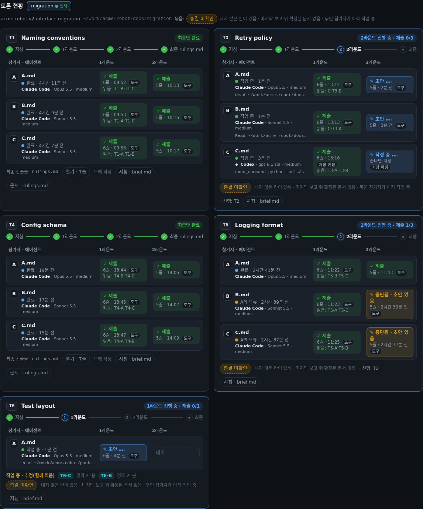
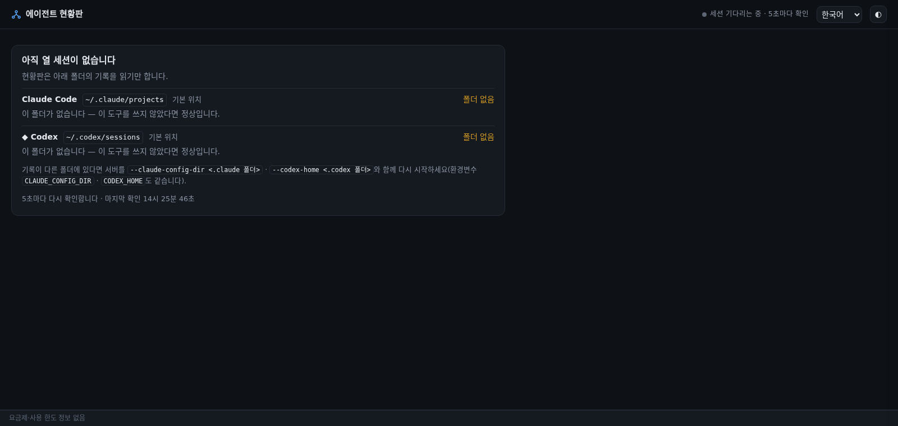

# Agent Bullpen (에이전트 현황판)

<p align="center"><a href="./README.md">English</a> · <b>한국어</b></p>

**에이전트 팀 전체를 한눈에.**

Claude Code 세션 하나가 서브에이전트, `claude -p`, Codex 실행을 여럿 띄워도 터미널에는 대화 하나만 보입니다. Agent Bullpen은 그 팀 전체를 한 화면에 실시간으로 보여 줍니다. 지금 누가 일하고 있는지, 누가 누구를 띄웠는지, 각 에이전트가 무엇을 하고 있는지, 서로 어떤 이야기를 주고받는지 바로 확인할 수 있습니다.

- **일하는 모습을 그대로** — 일하는 에이전트는 책상에 앉고, 토론이나 회의가 열리면 방에 모이고, 일을 마치면 휴게실에서 쉽니다.
- **오가는 대화를 한곳에서** — 사용자와 오케스트레이터의 대화, 그리고 오케스트레이터의 지시·에이전트의 보고·에이전트끼리 주고받는 메시지를 모은 카드를 따로 볼 수 있습니다.
- **진행 상황을 바로** — 라운드마다 누가 제출했는지, 사용 한도로 멈춘 실행의 한도가 언제 풀리는지, 에이전트별 비용(API 정가 기준)까지 보입니다.
- **설정이 필요 없음** — Claude Code와 Codex가 이미 남기는 기록을 읽기만 합니다. 훅도, 설치도, 계정도 필요 없습니다.




## 무엇을 보여 주나

- **오케스트레이터와 서브에이전트**: 상태(작업 중·완료·멈춤 의심·종료), 지금 쓰는 도구, 컨텍스트 사용량, 모델·effort. 멈춘 일은 구별해서 보여 줍니다. 사용 한도(초기화 시각 포함)·API 오류·시간 제한·중도 종료로 **중단됨**, 확인할 프로세스가 없으면 **알 수 없음**입니다. 서브에이전트나 다른 실행이 띄운 `claude -p` 실행은 띄운 쪽 아래에 놓입니다.
- **토론**: 에이전트가 실제로 쓴 `<주제>/r<N>/<참가자>.md` 파일(과 쓴 이)로 만드는 주제 × 라운드 × 참가자 표. 보고서는 화면에서 바로 읽고, 끝을 알 수 있는 문서가 없으면 "종결 미확인"이라고 솔직히 말합니다.
- **도트 사무실**(전체 화면은 `/game`): 일하는 에이전트는 책상에 앉고, 끝나면 휴게실로 가고, 서로 메시지를 전하러 걸어 다닙니다.
- **대화**: 사용자 ↔ 오케스트레이터, 에이전트 ↔ 에이전트.
- **알림**: 사용자가 판단해야 하는 것(답을 기다리는 질문, 멈추거나 실패한 에이전트, 사용 한도: 같은 초기화를 기다리는 것 전부에 알림 하나).
- **토큰과 비용**(에이전트별, API 정가로 환산한 값이며 실제 청구액이 아닙니다), 활동 타임라인, 요금제·사용 한도 줄.
- **Codex**를 Claude Code 옆에 같이 보여 줍니다. Claude가 띄운 `codex exec`는 같은 팀원이 되고, Codex 세션이 오케스트레이터일 때도 됩니다. 그 세션의 네이티브 서브에이전트와 셸이 띄운 `claude -p`·`codex exec` 실행이 그 아래에 모입니다. Codex 단독 대화도 따로 나옵니다.
- 서브에이전트가 없는 Claude 세션도 같이 나옵니다.
- **진단**: 현황판이 알아챘지만 판정하지 못한 것(두 후보 사이의 비김, 한 파일을 동시에 만든 두 에이전트, 모르는 기록 형식)을 기록의 글 없이 목록으로 보여 줍니다.

화면 하나하나의 설명은 [화면 설명서](docs/guide.ko.md)에 있습니다.






## 지원 현황

**베타(0.x).** Agent Bullpen은 Claude Code와 Codex가 디스크에 남기는 비공개 기록 형식을 읽습니다. 두 도구의 만든 쪽이 그 형식을 문서로 약속한 적이 없으므로, 어느 쪽이든 업데이트되면 현황판이 보는 것이 달라질 수 있습니다. 형식이 자리 잡을 때까지는 거친 곳이 있을 것이고, 0.x 사이에 옵션과 화면이 바뀔 수 있습니다([변경 기록](CHANGELOG.md)). 에이전트가 엉뚱한 곳에 있거나, 연결·상태가 틀리거나, 토론·회의가 인식되지 않으면 버그 템플릿으로 [이슈를 열어 주세요](https://github.com/bemong1/agent-bullpen/issues/new/choose). 템플릿이 `python3 tools/harvest.py <세션 id>`의 출력을 붙여 달라고 합니다. 이 출력은 사례의 모양(에이전트를 어떻게 띄웠는지, 보고서를 어떻게 썼는지, 실행이 어떻게 끝났는지)만 담고 기록 글·경로·시각·id는 담지 않습니다. 어떤 버전인지는 `python3 server.py --version`으로 알 수 있습니다.

| 플랫폼 | 상태 |
|---|---|
| Linux | 확인됨 |
| macOS | 실험적. 단위 시험은 CI에서 macOS로도 돌지만 Mac에서는 아직 확인하지 않았습니다. 프로세스 판정은 `ps`로 대신하고, `--host 0.0.0.0`일 때 이 기기의 주소 목록을 얻는 부분은 macOS용으로 써 두었을 뿐 아직 돌려 보지 못했습니다. |
| WSL2 | 실험적(Linux로 돌지만 아직 확인 전). |
| Windows(네이티브) | 지원하지 않습니다. |

**오케스트레이터.** 오케스트레이터는 **Claude Code** 세션이어도 **Codex** 세션이어도 됩니다. 서브에이전트(Claude Code의 Agent 도구, 또는 Codex의 네이티브 서브에이전트 스레드)와, 오케스트레이터나 그 서브에이전트나 그 실행이 띄운 `claude -p`·`codex exec` 실행이 오케스트레이터 아래에 모입니다. Codex 오케스트레이터는 Codex가 남기는 것(서브에이전트 사건, 명령 기록, 셸의 환경)을 읽어서 찾습니다. 보여 줄 수 없는 것은 [안내](docs/guide.ko.md#codex-오케스트레이터)에 있습니다. Codex 셸은 `&`만 붙여 띄운 자식을 호출이 끝날 때 함께 끝내고, 네이티브 서브에이전트가 받은 지시는 기록에서 암호화되어 있습니다.

**Python 3.9 이상**이 필요합니다. 표준 라이브러리만 쓰므로 `pip install`할 것이 없습니다.

> **언어.** 화면과 터미널 출력은 기본이 영어이고 한국어를 고를 수 있습니다. 화면은 머리글의 언어 선택기에서 고르거나 주소에 `?lang=ko`를 붙이거나 브라우저 언어에 맡깁니다. 터미널은 `--lang`, `AGENT_BULLPEN_LANG`, 로케일(`LANG`)을 따릅니다. 화면 글은 언어마다 사전 파일 하나(`static/locales/<코드>.json`)에 모여 있어서 새 언어는 JSON 파일 하나로 더합니다(서버는 재시작 없이 알아보고, 화면은 새로 고치면 됩니다. [`docs/development.md`](docs/development.md)). 문서는 영어([screen guide](docs/guide.md))와 한국어([화면 설명서](docs/guide.ko.md))가 있고, 설정·원격·개발 문서는 영어입니다.

## 빠른 시작

```bash
git clone https://github.com/bemong1/agent-bullpen.git
cd agent-bullpen
python3 server.py
```

<http://localhost:8790>을 엽니다. Claude Code나 Codex 세션이 있으면(또는 새로 시작하면) 나타납니다. 세션이 아직 없으면 화면이 읽은 폴더를 알려 주고 5초마다 다시 확인합니다.

서버는 시작할 때 주소, 읽은 폴더, 찾은 세션 수를 출력합니다.

```
현황판: http://localhost:8790/
  Claude Code   ~/.claude/projects           세션 2 · 에이전트 있는 세션 1  (기본)
  ◆ Codex       ~/.codex/sessions            단독 대화, 최근 7일: 0  (기본)
  프로세스 판정 /proc
세션 a11ce000-0000-4000-8000-000000000001 읽음: 에이전트 5명, 0.0s
```

한국어 로케일(`LANG=ko_KR.UTF-8`)이거나 `--lang ko`를 줄 때의 출력입니다. 영어(기본)는 `Dashboard: http://localhost:8790/`로 시작합니다.

### 샘플 데이터로 먼저 띄워 보기

아직 기록이 없거나, 내 작업에 연결하기 전에 바쁜 화면을 먼저 보고 싶다면 합성 `HOME`을 만들어 그 위에서 띄웁니다:

```bash
python3 tools/synth_home.py /tmp/acme-home --busy --live   # 지어낸 세션(--busy: 꽉 찬 사무실); --live는 일부를 작업 중으로 보이게 합니다; --stopped를 더하면 멈춘 일이 나옵니다
env -u CLAUDE_CONFIG_DIR -u CODEX_HOME HOME=/tmp/acme-home python3 server.py --port 8791
python3 tools/synth_home.py /tmp/acme-home --stop      # 다 보고 나서: 가짜 프로세스 끄기
```

<http://localhost:8791>을 엽니다. 데모 시나리오(`/game?demo=all`)도 이 데이터 위에서 돕니다.

### 다른 기기에서 보기

`--host`에 열 주소를 줍니다: `0.0.0.0`(모든 네트워크 카드, 곧 LAN과 VPN), 주소 하나(예: VPN이 이 기기에 준 100.x 주소), `::`, 또는 호스트 이름. 루프백이 아닌 주소에는 **접속 토큰**이 켜집니다. 서버가 시작할 때마다 무작위 토큰을 만들어 열 주소를 출력합니다.

```bash
python3 server.py --host 0.0.0.0
```

```
현황판 — 접속 토큰이 필요합니다. 아래 중 하나로 여세요:
  http://localhost:8790/?token=Qw3dJ8…
  http://192.168.0.5:8790/?token=Qw3dJ8…
  http://100.64.0.2:8790/?token=Qw3dJ8…
처음 열면 브라우저가 토큰을 쿠키로 기억해 다음부터는 토큰 없이 열립니다. …
```

다른 기기에서 그 주소 중 하나를 엽니다. 서버가 쿠키를 주고 브라우저를 토큰 없는 같은 주소로 다시 보내므로, 토큰이 주소창과 기록에 남지 않습니다. 새로 고침이나 다음 방문에는 서버를 다시 켤 때까지 더 할 일이 없습니다(아래 참고). 토큰(또는 쿠키)이 없으면 모든 화면과 API가 짧은 안내와 함께 401로 답하고, 스크립트는 `Authorization: Bearer <토큰>` 헤더를 보내면 됩니다.

- `--token VALUE`(또는 프로세스 목록에 남지 않는 환경변수 `AGENT_BULLPEN_TOKEN`)로 시작마다 새로 만드는 대신 토큰을 고정할 수 있습니다. 토큰을 주면 루프백에서도 검사합니다.
- `--no-auth`는 루프백이 아닌 주소에서 검사를 끕니다. 그러면 포트에 닿는 사람은 누구나 대화를 읽을 수 있고, 서버가 테두리 친 경고로 알립니다.
- 토큰과 쿠키는 http로 암호화 없이 오갑니다. 믿는 네트워크(VPN, 내 LAN)에서만 쓰고, 열린 네트워크에서는 쓰지 마세요. 포트를 공개하지도 마세요.
- 옵션이 필요 없는 다른 길은 SSH 터널입니다. 서버를 루프백에 두고 `ssh -L 8790:localhost:8790 you@the-machine`을 하면, 앉은 기기에서 `http://localhost:8790`이 됩니다.

이름과 `--allow-host`, VPN 참고, 안 열릴 때 확인할 것: [`docs/remote.md`](docs/remote.md)(영어).

## 옵션

```
python3 server.py [옵션]
```

| 옵션 | 기본값 | 뜻 |
|---|---|---|
| `--claude-config-dir DIR` | `$CLAUDE_CONFIG_DIR`, 없으면 `~/.claude` | Claude Code 설정 폴더. 기록은 `DIR/projects`에서 읽습니다. |
| `--codex-home DIR` | `$CODEX_HOME`, 없으면 `~/.codex` | Codex 폴더. 기록은 `DIR/sessions`(최근 7일)에서 읽습니다. |
| `--port PORT` | `8790` | 열 포트. 이미 쓰고 있으면 한 줄 안내 뒤 끝납니다. |
| `--host ADDR` | `127.0.0.1` | 열 주소(여러 번 가능). IP 주소(`0.0.0.0`, `::`, LAN·VPN 주소)나 호스트 이름 모두 됩니다. 루프백에는 로그인이 없고, 다른 주소에는 접속 토큰이 필요합니다([위](#다른-기기에서-보기)). `--host ::1`은 IPv6 루프백으로 열며 `http://[::1]:8790/`으로 접속합니다. |
| `--token VALUE` | 시작마다 새 무작위 토큰 | 고정 접속 토큰: 영문·숫자와 `. _ ~ -`로 16자 이상. 환경변수 `AGENT_BULLPEN_TOKEN`도 되며 옵션이 우선합니다. 토큰을 주면 루프백에서도 검사합니다. |
| `--no-auth` | 끔 | 루프백이 아닌 주소에서도 토큰 검사를 하지 않습니다. 테두리 친 경고를 출력합니다. `--token`과 함께 쓸 수 없습니다. |
| `--allow-host NAME` | 없음 | 토큰 검사가 없는 곳(루프백 주소, `--no-auth`)에서 `Host` 헤더로 더 받을 이름(여러 번 가능). 이름(`my.box`) 또는 접미사(`.example.net`: `a.example.net`은 되고 `example.net` 자신은 안 됨). 토큰이 있으면 모든 이름을 받습니다. |
| `--session ID` | 가장 최근에 움직인 오케스트레이션, 없으면 가장 최근 일반 대화 | 주소에 세션이 없을 때 열 세션(UUID). |
| `--lang CODE` | `auto`: `AGENT_BULLPEN_LANG`, `LC_ALL`, `LC_MESSAGES`, `LANG` 순서, 없으면 `en` | 터미널 출력과 `--help`의 언어(`en`, `ko`). 화면 언어는 따로입니다: 머리글의 선택기, `?lang=`, 브라우저. |
| `--no-link-cache` | 끔 | 확실한 세션 연결을 `links.json`에 남기지 않습니다([보안과 개인정보](#보안과-개인정보)). |
| `--version` | | 버전을 보이고 끝냅니다. |

자세한 설명과 우선순위: [`docs/configuration.md`](docs/configuration.md)(영어).

### 상태 줄로 사용률 보기

Claude Code는 상태 줄 명령에 JSON을 넘기는데, 거기에 5시간·주간 사용률이 이미 들어 있습니다. 이 폴더의 `statusline.py`(표준 라이브러리만)가 그 숫자만 작은 파일에 남기고 현황판이 그 파일을 읽습니다: 요청도, 토큰 읽기도, 서버 옵션도 없습니다. (현황판이 직접 Anthropic에 사용률을 묻는 일은 없습니다.)

```
python3 statusline.py --print-config
```

`~/.claude/settings.json`에 합칠 조각을 출력합니다(파일은 고치지 않습니다). 이미 쓰는 상태 줄이 있으면 그것을 이어 붙이므로 전과 똑같이 그려집니다:

```json
{
  "statusLine": { "type": "command", "command": "python3 /path/to/agent-bullpen/statusline.py --chain '~/.claude/my-statusline.sh'" }
}
```

(상태 줄이 없으면 명령은 `python3 /path/to/agent-bullpen/statusline.py`뿐이고 아무것도 그리지 않습니다. 짧은 사용률 글을 보려면 `--show`를 덧붙이세요.)

- **남기는 것:** `$XDG_CACHE_HOME/agent-bullpen/statusline.json`(기본 `~/.cache/agent-bullpen/`, 폴더 0700, 파일 0600). 담기는 것은 `{"v":1,"at":<받은 시각>,"rate_limits":{"five_hour":{"used_percentage":…,"resets_at":…},"seven_day":{…}}}`뿐입니다. 다만 게이트웨이 계정이면 지출 한도(`spend_limit`: 퍼센트·재설정 시각·쓴 금액과 한도 금액(달러)·기간)도 남습니다. 입력에 있던 경로·세션 id·모델·비용·지시문은 남기지 않습니다.
- **화면:** 요금제 줄의 5시간·주간 값 뒤에 회색 "상태 줄 · HH:MM"으로 보입니다. 출처 순서는 상태 줄 파일 → `.claude.json` 캐시("기록 HH:MM · /usage로 갱신", Claude Code가 `/usage`를 열 때 갱신합니다)입니다. 상태 줄이 담지 않는 것(Sonnet 같은 모델별 주간, 추가 사용)은 늘 그 캐시에서 오며, 상태 줄 시각 아래가 아니라 캐시 자신의 "기록 HH:MM"과 함께 보입니다.
- **감수할 것:** 값은 Claude Code가 상태 줄을 그리는 동안(세션이 열려 있고 움직이는 동안)에만 바뀝니다. 설정하지 않으면 하단 줄은 캐시 값을, 캐시도 없으면 한 줄 안내("Claude Code에서 /usage를 열면 보입니다")를 보입니다.

자세한 설명·옵션(`--chain`, `--chain-timeout`, `--show`)·규칙: [`docs/configuration.md`](docs/configuration.md#statuslinepy-plan-usage-from-the-status-line)(영어).

## 보안과 개인정보

- **읽기만 합니다.** Claude Code·Codex 폴더(기본 `~/.claude`·`~/.codex`)에 쓰지 않습니다. 세션 기록과, 요금제 등급·사용률 캐시를 위해 Claude Code의 `.claude.json`을 읽고(계정 id·이메일은 화면으로 내보내지 않습니다), 상태 줄 명령을 설정했다면 `statusline.json`도 읽습니다(위). `auth.json`, `.credentials.json`, `settings*.json`, `config.toml`, `history.jsonl`, Codex sqlite는 열지 않습니다. 서버 안에는 내 로그인이나 토큰을 읽는 코드가 없습니다.
- **누가 열 수 있나.** 루프백 주소(기본 `127.0.0.1`)에는 로그인이 없습니다. 이 기기의 어떤 프로그램이나 사용자든 포트로 대화를 읽을 수 있습니다(파일을 읽을 수 있는 것과 같습니다). 그 밖의 주소(`--host 0.0.0.0`, LAN·VPN 주소, 호스트 이름)에는 접속 토큰이 필요합니다: 시작마다 무작위이고, 상수 시간으로 비교하며, 시작할 때 출력하는 주소 말고는 로그·응답·화면에 나오지 않고, 처음 열 때 토큰과 시작마다 새로 만드는 소금에서 파생한 값을 담은 `HttpOnly`·`SameSite=Strict` 쿠키로 바뀝니다. 그래서 토큰 자체는 응답에 다시 나오지 않고, 서버를 다시 켜면 복사해 둔 쿠키는 죽습니다(`--token`으로 토큰을 고정해도 마찬가지입니다). `--no-auth`는 검사를 없애고 테두리 친 경고를 출력합니다. 내가 온전히 통제하는 네트워크 밖에서는 쓰지 마세요. 토큰과 쿠키는 전송 중 암호화되지 않으므로 믿지 못할 곳에서는 VPN이나 SSH 터널을 쓰고, 포트를 인터넷에 열지 마세요.
- **외부로 나가는 요청이 없습니다.** 서버는 네트워크를 부르지 않고, 화면도 인터넷에서 받는 것이 없습니다(글꼴을 동봉했습니다). Claude 요금제 줄은 상태 줄 파일이나 `.claude.json` 캐시에서 오며 요청으로 얻지 않습니다. 서버가 기본으로 쓰는 파일은 작은 연결 기록 `links.json` 하나뿐입니다(`$XDG_CACHE_HOME/agent-bullpen/`, 기본 `~/.cache/agent-bullpen/`, 권한 0600). 자식 세션을 그것을 띄운 세션에 확실한 증거(프로세스 계보, 환경변수, 출력 파일, 일치하는 긴 지시문)로 이으면 두 세션 id와 규칙·시각만(경로·지시문·환경변수 값은 없음) 최대 2000개, 90일까지 남겨 재시작해도 연결을 잊지 않게 하고, 그런 연결을 찾기 전에는 아무것도 만들지 않습니다. 추정은 남기지 않습니다. `--no-link-cache`로 끕니다. `statusline.py`를 Claude Code 상태 줄로 등록하면 서버가 아니라 그 명령이 같은 폴더에 `statusline.json`도 남깁니다: 5시간·주간 사용률과 재설정 시각, 받은 시각뿐이고 권한은 0600이며, 서버는 읽기만 합니다.
- **문서 보기는 좁게 열립니다.** 에이전트가 쓴 파일과 토론 폴더 안의 파일(`.md`·`.txt`·`.yaml`·`.json`, 일반 파일, 2 MiB까지)만 엽니다. 인증·설정 파일, `~/.codex` 아래, 경로에 점(`.`) 폴더가 든 파일(예외는 Claude Code worktree `<저장소>/.claude/worktrees/<이름>/`뿐이고, 그 안에서도 `.env`·`.git` 같은 점 성분은 닫혀 있습니다), 비밀처럼 보이는 이름(`secret`·`credential`·`password`·`token`·`apikey`·`kubeconfig…`)의 파일은 `.md`도 포함해 열지 않습니다. 토론 표는 더 느슨해서 보고서 파일이 있는지만 봅니다. 그래서 숨김 폴더 아래의 보고서나 `token_budget.md` 같은 이름도 "제출"로 보이지만, 화면에서 열 수는 없으니 열어 보려는 보고서 이름에는 이런 낱말을 쓰지 마세요.
- **Host 검사.** 토큰 검사가 없는 곳(루프백, `--no-auth`)에서는 `Host` 헤더가 허용 목록에 없으면 403입니다(DNS rebinding 방어). 토큰이 있으면 어떤 이름이든 받습니다: 다른 사이트의 페이지는 이 서버의 쿠키를 갖고 있지 않습니다.
- **내 화면 캡처에는 내 대화가 들어 있습니다.** 이 저장소의 스크린샷은 합성 데이터로 만든 것입니다.

## 토론 폴더 규칙

토론은 폴더와 에이전트가 실제로 쓴 것으로 알아봅니다. 지시문에 뭐라고 적었는지는 보지 않습니다. 에이전트마다 자기 파일을 회차 폴더에 쓰게 하고, 함께 띄우세요.

```
<주제>/
  brief.md          # 선택: 첫 제목이 제목이 됩니다
  r1/A.md           # 1라운드, 참가자마다 파일 하나(파일 이름이 줄 이름)
  r1/B.md
  r2/A.md           # 2라운드 …
  rulings.md        # 끝: 마지막 보고 뒤에 쓴 문서
```

- 토론은 회차 폴더가 든 폴더입니다. 칸은 거기에 에이전트가 쓴 파일입니다(`Write`·`Edit`, Codex 파일 변경, 성공한 셸 `>`·`tee`, 또는 `codex exec -o` / `claude -p … >`가 저장하라고 받은 파일). 처음 만든 에이전트가 주인입니다. 주인이 없는 파일, 또는 주인이 다시 저장하라는 요청을 받고 아직 저장하지 않은 파일은 회색 "이전 파일"입니다.
- 아직 파일이 없지만 참가자와 함께 띄워졌거나, 띄운 호출이 폴더를 만들었거나, 그 `brief.md`를 읽은 에이전트는 **"작업 중 · 추정"**으로 나옵니다. 추정은 아무것도 바꾸지 않습니다.
- 회차 폴더가 없으면 `BULLPEN_ROOM=<폴더>`를 단 에이전트 둘 이상이 **방**을 만들고, 함께 띄워져 그 폴더에 각자 `.md`를 쓴 에이전트들은 추정 방을 만듭니다(현재 토론이 되지 않고 닫히지도 않습니다). 검토는 `r1/`이나 꼬리표가 있어야 합니다.
- **꼬리표(선택)**는 띄우는 명령 자체에 붙입니다: `BULLPEN_ROOM=<폴더> BULLPEN_SEAT=<이름>`(토론에서는 `<rN/이름>`). Agent 도구와 Codex 네이티브 서브에이전트는 붙일 수 없습니다.
- **주제의 끝**은 확정 최종입니다: 주제 폴더 안에 마지막 보고 뒤 도구나 셸 명령이 쓴 `.md`가 하나뿐이고, 모든 칸이 제출됐고, 주제에 묶인 사람이 아무도 일하지 않을 때입니다. 아니면 이유와 후보가 붙은 **"종결 미확인"**입니다. 지침 표의 `final/…`는 보여 줄 뿐 믿지 않습니다.

전체 규칙은 [`docs/guide.ko.md`](docs/guide.ko.md#토론을-알아보는-방법)에 있습니다.

## 데모

`http://localhost:8790/game?demo=all`은 사무실 화면에서 시나리오를 모두 재생합니다(`basic`·`new`·`round2`·`trouble`·`talk`, 현황판은 `/?demo=<이름>`). 데모는 브라우저 안에서만 돌고 아무것도 바꾸지 않지만, 열려 있는 세션 위에 그리므로 세션이 하나 이상 열려 있어야 합니다. 세션이 없으면 진단 칸이 대신 나옵니다.

## 문제 해결

**빈 화면이거나 "아직 열 세션이 없습니다".** 오류가 아닙니다. 읽은 폴더, 그 폴더가 어디서 왔는지(기본·환경변수·명령 인자), 찾은 세션 수를 보여 주고 5초마다 다시 확인합니다.



- *폴더 없음* → 기록이 다른 곳에 있습니다. `--claude-config-dir <폴더>` / `--codex-home <폴더>`로 시작하거나 `CLAUDE_CONFIG_DIR` / `CODEX_HOME`을 설정하세요.
- *세션 0* → 폴더는 맞지만 아직 대화 기록이 없습니다. Codex는 최근 7일만 봅니다.
- 세션은 있는데 원하는 것이 안 보임 → 주소에 `?session=<id>`를 붙여 엽니다(`--session`도 같은 UUID). 서브에이전트가 없는 대화는 오케스트레이션과 따로 "다른 세션" 메뉴나 프로젝트 선택의 "일반 대화 · 서브에이전트 없음" 묶음에 있습니다.

**에이전트가 "중단됨"이나 "알 수 없음"이라고 하거나, 실행이 에이전트 목록에 없음.** 중단됨은 사용 한도(카드에 초기화 시각이 나옵니다)·API 오류·시간 제한·중도 종료로 멈춘 일입니다. 알 수 없음은 확인할 프로세스가 없고 기록도 조용해진 것입니다. 띄운 세션에 잇지 못한 `claude -p` 실행은 에이전트가 아니라 접힌 묶음 "연결 안 된 하위 실행 N개"에 이유와 함께 있습니다. 머리글의 진단 칩은 현황판이 판정하지 못한 것을 모두 보여 줍니다([화면 설명서](docs/guide.ko.md#진단)).

**포트 충돌.**

```
현황판을 열지 못했습니다: 127.0.0.1:8790 — 포트를 이미 쓰고 있습니다. 이미 띄운 현황판이면 http://localhost:8790/ 을 여세요. 다른 포트로 띄우려면 --port 8791 처럼 주세요.
```

(한국어 출력입니다. 영어는 `Couldn't start the dashboard on 127.0.0.1:8790 — the port is already in use. …`.)

예전에 띄운 현황판이 아직 떠 있을 가능성이 큽니다. 그것을 열거나 다른 `--port`를 주세요.

**401 "접속 토큰이 필요합니다".** 연 주소에 토큰이 없고 브라우저에도 이 서버의 쿠키가 없습니다(서버를 새로 시작하면 토큰도 새로 생기고, 쿠키는 브라우저마다 따로입니다). `--token`으로 고정하면 토큰은 그대로여도 쿠키는 그대로가 아닙니다: 서버를 켤 때마다 그 전에 준 쿠키는 쓸모가 없어지므로, 다시 켠 뒤에는 토큰이 붙은 주소로 한 번 더 여세요. 서버가 시작할 때 출력한 주소(`http://…/?token=…`)나, `--token`으로 고정한 토큰이 붙은 주소로 여세요. 서버를 다시 시작할 때 이미 열려 있던 화면은 머리줄(사무실은 붉은 줄)에 "토큰 필요 · 시작 때 출력된 주소로 다시 열기"라고 알리고, 이 브라우저가 새 토큰을 받으면 다시 실시간으로 돌아옵니다.

**403 "Host not allowed".** 토큰 검사가 없는 곳(루프백, `--no-auth`)에서만 나옵니다. 서버가 모르는 이름(VPN 이름, 리버스 프록시)으로 접속했습니다. `--allow-host <그 이름>`이나 `--allow-host .example.net` 같은 접미사로 다시 시작하세요. 403 화면이 필요한 플래그를 알려 줍니다. 토큰이 있으면(루프백이 아닌 `--host`) 이름은 보지 않습니다.

**화면이나 터미널의 언어가 원하는 것과 다름.** 화면은 `?lang=`, 머리글 선택기에서 마지막으로 고른 값, 브라우저 언어, 영어 순서이고, 터미널은 `--lang`, `AGENT_BULLPEN_LANG`, `LC_ALL`, `LC_MESSAGES`, `LANG`, 영어 순서입니다([화면 설명서](docs/guide.ko.md#화면-언어와-터미널-언어)).

**`--host`로 기동이 안 됨.** 주소는 이 기기의 IP 주소(`0.0.0.0`, `::` 포함)이거나 여기서 찾아지는 호스트 이름이어야 하고 포트는 붙이지 않습니다. 어느 쪽이 문제인지 메시지에 나옵니다. VPN 주소는 VPN이 꺼져 있으면 없어집니다.

## 개발

시험은 표준 라이브러리 `unittest`입니다. 구조와 회귀 도구는 [`docs/development.md`](docs/development.md)(영어)에 있습니다.

```bash
python3 -m unittest discover -s tests
```

## 고지

비공식 도구입니다 — Anthropic·OpenAI와 무관합니다(Unofficial — not affiliated with Anthropic or OpenAI). "Claude", "Claude Code", "Codex", "OpenAI"는 각 소유자의 상표입니다. 사무실 화면의 모니터 기호(`>_`, ◆)는 로고가 아니라 중립 기호입니다.

## 라이선스

[MIT](LICENSE). 동봉한 Galmuri 글꼴은 SIL Open Font License를 따릅니다([`THIRD_PARTY.md`](THIRD_PARTY.md)).
