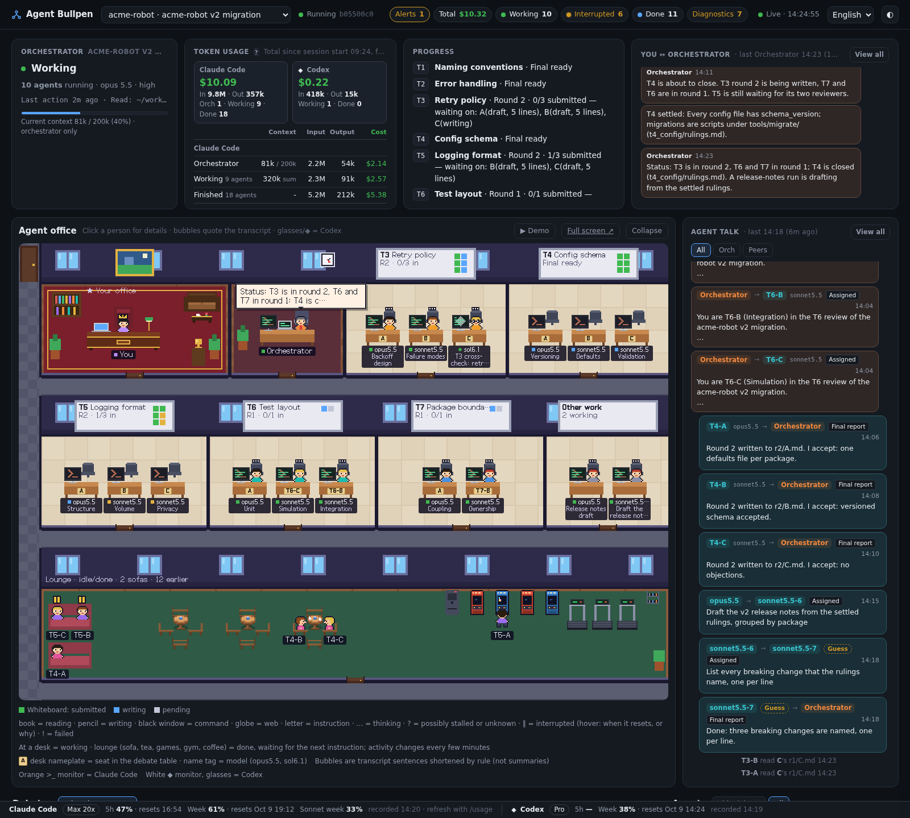
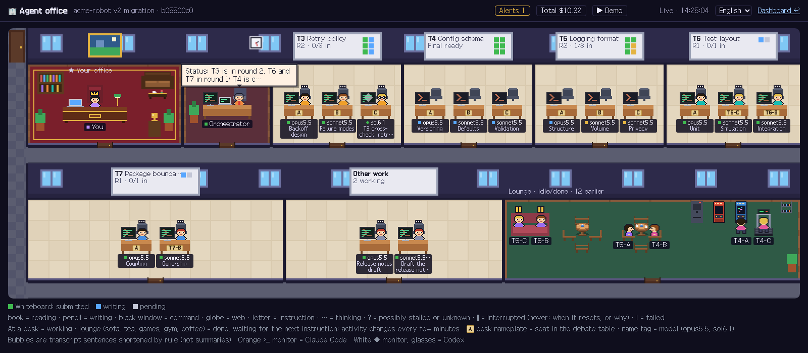
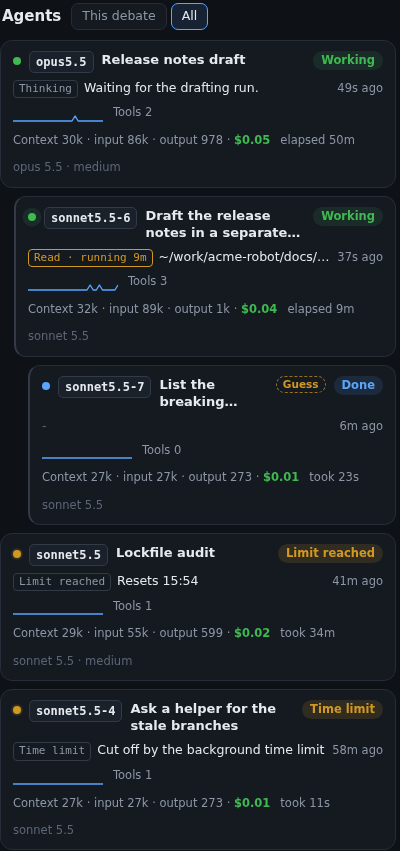
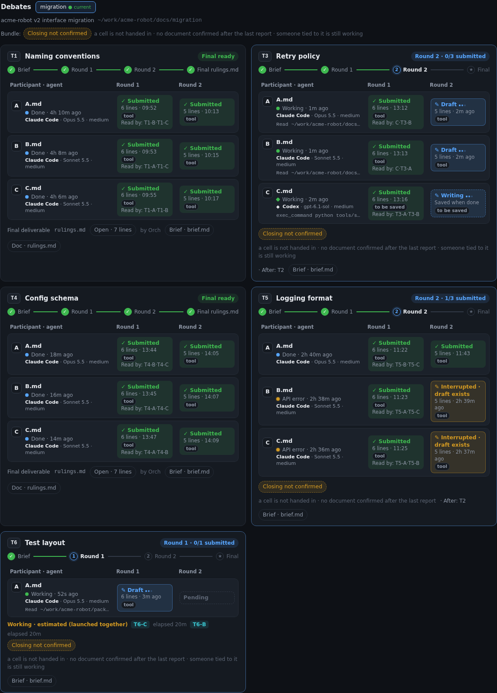
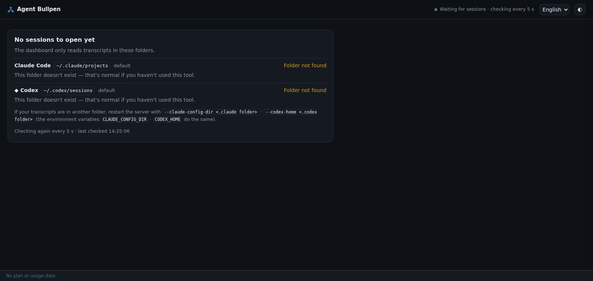

# Agent Bullpen

<p align="center"><b>English</b> · <a href="./README.ko.md">한국어</a></p>

**Your whole agent team, at a glance.**

When one Claude Code session starts sub-agents, `claude -p` runs and Codex runs, your terminal still shows a single conversation. Agent Bullpen shows the whole team on one live page: who is working, who started whom, what each agent is doing right now, and what they are saying to each other.

- **Watch the team work** — agents sit at their desks while they work, gather in a room for debates and meetings, and rest in the lounge when they are done.
- **Follow the conversation** — your conversation with the orchestrator, and a separate card for its instructions, the agents' reports and the messages agents send each other.
- **See where things stand** — who has turned in what in each round, when the usage limit that stopped a run resets, and what each agent costs (at API list prices).
- **No setup** — it reads the transcripts Claude Code and Codex already write. No hooks, no install, no account.




## What it shows

- **Orchestrator and agents**: status (working, done, stalled, ended), the tool each one is using right now, context fill, model and effort. Work that stopped is told apart: **interrupted** by a usage limit (with the reset time), an API error, a time limit or an early exit, or **unknown** when there is no process to check. A `claude -p` run started by an agent or by another run stands under the one that started it.
- **Debates**: a topic × round × participant table built from the `<topic>/r<N>/<who>.md` files the agents really wrote (and who wrote them), with the reports readable in the page and an honest "closing not confirmed" when no document can be told to be the end.
- **A pixel-art office** (`/game` for full screen): agents sit at desks while they work, walk to the lounge when done, and carry messages to each other.
- **Conversations**: you ↔ orchestrator, and agent ↔ agent.
- **Alerts** for things that need you: a pending question, a stalled or failed agent, a usage limit (one alert for everything that waits on the same reset).
- **Tokens and cost** per agent (API-price equivalent, not your bill), an activity timeline, and a plan / usage bar.
- **Codex** next to Claude Code: `codex exec` runs that Claude launches join the team, and a Codex session can be the orchestrator too: its native sub-agents and the `claude -p` and `codex exec` runs its shell starts are gathered under it; Codex-only conversations are listed as well.
- Plain Claude sessions with no agents are listed as well.
- **Diagnostics**: what the dashboard noticed but could not settle (a tie between two possible launchers, two agents that created one file at once, an unknown transcript format), in a list that never contains transcript text.

Every panel is explained in the [screen guide](docs/guide.md).







## Status / Support

**Beta (0.x).** Agent Bullpen reads the private on-disk formats of the Claude Code and Codex transcripts. Their makers do not document or promise those formats, so an update of either tool can change what the dashboard sees; expect rough edges until they settle, and expect options and screens to change between 0.x releases (see the [changelog](CHANGELOG.md)). If an agent is in the wrong place, a link or a status is wrong, or a debate or meeting is not recognized, please [open an issue](https://github.com/bemong1/agent-bullpen/issues/new/choose) with the bug template. It asks for the output of `python3 tools/harvest.py <session id>`, which prints only the shape of the case (how agents were launched, how reports were written, how runs ended): no transcript text, path, time or id. `python3 server.py --version` tells which release you run.

| Platform | Status |
|---|---|
| Linux | Verified |
| macOS | Experimental. The unit tests run on macOS in CI; it is not yet verified on a Mac. Process detection falls back to `ps`, and a few things (the list of this machine's addresses for `--host 0.0.0.0`) are written for macOS but not yet run there. |
| WSL2 | Experimental (runs as Linux, not yet verified). |
| Windows (native) | Not supported. |

**Orchestrator.** The orchestrator can be a **Claude Code** or a **Codex** session. Its sub-agents (Claude Code's Agent tool, or Codex's native sub-agent threads) and the `claude -p` and `codex exec` runs it starts, or that its sub-agents or those runs start in turn, are gathered under it. For a Codex orchestrator the dashboard reads what Codex records: the sub-agent events, the command records and the environment of its shells (see the [guide](docs/guide.md#a-codex-orchestrator) for what it cannot show: a Codex shell ends a child started with a bare `&`, and the instruction of a native sub-agent is encrypted in the record).

Requires **Python 3.9+**. The standard library only: nothing to `pip install`.

> **Languages.** The dashboard and the terminal output are in English by default, and Korean is available: pick it in the language selector in the header, add `?lang=ko` to the address, or let your browser's language decide. The terminal follows `--lang`, `AGENT_BULLPEN_LANG` or your locale (`LANG`). All the screen text lives in one dictionary file per language (`static/locales/<code>.json`), so adding a language is one JSON file (the server picks it up without a restart; reload the page): see [`docs/development.md`](docs/development.md). The documentation is in English (the [screen guide](docs/guide.md)) and Korean ([화면 설명서](docs/guide.ko.md)).

## Quickstart

```bash
git clone https://github.com/bemong1/agent-bullpen.git
cd agent-bullpen
python3 server.py
```

Open <http://localhost:8790>. Start (or already have) a Claude Code or Codex session and it appears; with no sessions yet the page tells you which folders it looked in and checks again every 5 seconds.

On start the server prints the address, the folders it reads and how many sessions it found:

```
Dashboard: http://localhost:8790/
  Claude Code   ~/.claude/projects           sessions 2 · with agents 1  (default)
  ◆ Codex       ~/.codex/sessions            standalone sessions, last 7 days: 0  (default)
  Process check /proc
Session a11ce000-0000-4000-8000-000000000001 loaded in 0.0s · agents 5
```

### Try it with sample data first

No transcripts of your own yet, or want to see a busy dashboard before pointing it at your work? Build a synthetic `HOME` and run the server on it:

```bash
python3 tools/synth_home.py /tmp/acme-home --busy --live   # made-up sessions (--busy: a full office); --live makes some show as working; add --stopped for stopped work
env -u CLAUDE_CONFIG_DIR -u CODEX_HOME HOME=/tmp/acme-home python3 server.py --port 8791
python3 tools/synth_home.py /tmp/acme-home --stop      # afterwards: stop the fake processes
```

Open <http://localhost:8791>. The demo scenarios (`/game?demo=all`) also play on this data.

### Viewing it from another device

Give `--host` the address to listen on: `0.0.0.0` (every network card, so the LAN and a VPN), one address (for example the 100.x address a VPN gave this machine), `::`, or a host name. An address that is not loopback turns on an **access token**: the server makes a random one at every start and prints the addresses to open.

```bash
python3 server.py --host 0.0.0.0
```

```
Dashboard — an access token is needed. Open one of these:
  http://localhost:8790/?token=Qw3dJ8…
  http://192.168.0.5:8790/?token=Qw3dJ8…
  http://100.64.0.2:8790/?token=Qw3dJ8…
The browser keeps the token in a cookie after the first visit, so later visits need no token. …
```

Open one of those addresses on the other device. The server sets a cookie and sends the browser on to the same address without the token, so the token does not stay in the address bar or in the history; a reload or a later visit needs nothing more, until the server is started again (see below). Without the token (or the cookie) every page and every API answers 401 with a short note; a script can send `Authorization: Bearer <token>` instead.

- `--token VALUE` (or the environment variable `AGENT_BULLPEN_TOKEN`, which keeps it out of the process list) fixes the token instead of making a new one at every start. Setting one turns the check on for loopback addresses too.
- `--no-auth` switches the check off on a non-loopback address. Then anyone who can reach the port can read your conversations, and the server says so in a framed warning.
- The token and the cookie travel unencrypted over http. Use a network you trust (a VPN, your own LAN), never an open one, and never publish the port.
- The other way needs no option: an SSH tunnel keeps the server on loopback, and `ssh -L 8790:localhost:8790 you@the-machine` makes it `http://localhost:8790` on the device you sit at.

More (names and `--allow-host`, VPN notes, what to check when it does not open): [`docs/remote.md`](docs/remote.md).

## Options

```
python3 server.py [options]
```

| Option | Default | Meaning |
|---|---|---|
| `--claude-config-dir DIR` | `$CLAUDE_CONFIG_DIR`, else `~/.claude` | Claude Code config folder; transcripts are read from `DIR/projects`. |
| `--codex-home DIR` | `$CODEX_HOME`, else `~/.codex` | Codex folder; transcripts are read from `DIR/sessions` (last 7 days). |
| `--port PORT` | `8790` | Port to listen on. If it is taken, the server says so in one line and exits. |
| `--host ADDR` | `127.0.0.1` | Address to listen on; may be repeated. Any IP address (`0.0.0.0`, `::`, a LAN or VPN address) or a host name. Loopback has no login; any other address requires an access token ([above](#viewing-it-from-another-device)). `--host ::1` opens an IPv6 loopback listener: use `http://[::1]:8790/`. |
| `--token VALUE` | a new random token at every start | Fixed access token: at least 16 characters, letters, digits and `. _ ~ -`. Also `AGENT_BULLPEN_TOKEN` (the option wins). Setting one turns the check on for loopback too. |
| `--no-auth` | off | No token check, even on a non-loopback address; prints a framed warning. Cannot be combined with `--token`. |
| `--allow-host NAME` | none | Extra names accepted in the `Host` header where there is no token check (a loopback address, or `--no-auth`); may be repeated. A name (`my.box`) or a suffix (`.example.net`, which matches `a.example.net` but not `example.net`). With a token every name is accepted. |
| `--session ID` | most recently active orchestration, or the most recent plain conversation if there is none | Session (UUID) to open when the URL names none. |
| `--lang CODE` | `auto`: `AGENT_BULLPEN_LANG`, then `LC_ALL`, `LC_MESSAGES`, `LANG`, else `en` | Language of the terminal output and `--help` (`en`, `ko`). The screen language is separate: the selector in the header, `?lang=`, your browser. |
| `--no-link-cache` | off | Do not keep the certain session links in `links.json` (see [Security & privacy](#security--privacy)). |
| `--version` | | Print the version and exit. |

Details and precedence rules: [`docs/configuration.md`](docs/configuration.md).

### Plan usage from Claude Code's status line

Claude Code hands its status line command a JSON document that already holds your 5-hour and weekly usage. `statusline.py` (in this folder, standard library only) keeps just those numbers in a small file and the dashboard reads it: no request, no token read, no server option. (The dashboard never asks Anthropic for your usage itself.)

```
python3 statusline.py --print-config
```

prints the piece to merge into `~/.claude/settings.json`; it does not edit the file. If you already have a status line it is kept as the chain, so it keeps drawing as before:

```json
{
  "statusLine": { "type": "command", "command": "python3 /path/to/agent-bullpen/statusline.py --chain '~/.claude/my-statusline.sh'" }
}
```

(With no status line yet, the command is just `python3 /path/to/agent-bullpen/statusline.py`, which draws nothing; add `--show` for a short usage text.)

- **What it leaves:** `$XDG_CACHE_HOME/agent-bullpen/statusline.json` (default `~/.cache/agent-bullpen/`, folder 0700, file 0600): `{"v":1,"at":<time received>,"rate_limits":{"five_hour":{"used_percentage":…,"resets_at":…},"seven_day":{…}}}` and nothing else, except that with a gateway account the spending limit (`spend_limit`: percentage, reset time, the dollar amounts used and allowed, and the period) is kept too. No path, session id, model, cost or instruction from the input is kept.
- **On the screen** the plan bar shows "status line · HH:MM" in gray after the 5-hour and weekly values. Order of sources: the status line file, then the `.claude.json` cache ("recorded HH:MM · refresh with /usage"; Claude Code refreshes it when you open `/usage`). What the status line does not carry (a model's own week such as Sonnet, extra usage) always comes from that cache and is shown with the cache's own "recorded HH:MM", never under the status line's time.
- **What it costs you:** the numbers update only while Claude Code is drawing its status line (a session is open and active). Without it the bar shows the cache, or one hint line ("Open /usage in Claude Code to see this") when there is none.

Details, options (`--chain`, `--chain-timeout`, `--show`) and the exact rules: [`docs/configuration.md`](docs/configuration.md#statuslinepy-plan-usage-from-the-status-line).

## Security & privacy

- **Read-only.** It never writes to your Claude Code or Codex folders (`~/.claude` and `~/.codex` by default). It reads session transcripts, plus Claude Code's `.claude.json` for the plan tier and cached usage numbers (account id and email are never sent to the page), and `statusline.json` if you set up the status line command (above). It does not open `auth.json`, `.credentials.json`, `settings*.json`, `config.toml`, `history.jsonl` or the Codex sqlite files: no code in the server reads a login or a token of yours.
- **Who can open it.** On a loopback address (the default, `127.0.0.1`) there is no login: any program or user on this machine can read your conversations through the port, as they could read your files. On any other address (`--host 0.0.0.0`, a LAN or VPN address, a host name) an access token is required: random at every start, compared in constant time, shown only in the addresses printed at start (never in a log, a response or the page), and exchanged at the first visit for an `HttpOnly`, `SameSite=Strict` cookie whose value is derived from it and from a salt made at each start, so the token itself never comes back in a response and a copied cookie dies when the server is started again (even with a token fixed by `--token`). `--no-auth` removes the check and prints a framed warning; do not use it outside a network you fully control. The token and the cookie are not encrypted in transit: use a VPN or an SSH tunnel on anything you do not trust, and never expose the port to the internet.
- **No outbound requests.** The server makes no network calls, and the pages load nothing from the internet (the font is bundled). The Claude plan bar comes from the status line file or the `.claude.json` cache, never from a request. The one file the server writes by default is a small link record, `links.json` in `$XDG_CACHE_HOME/agent-bullpen/` (default `~/.cache/agent-bullpen/`, mode 0600): when a child session is tied to the session that started it by firm evidence (process lineage, an environment variable, an output file or a long instruction that matches), it keeps the two session ids with the rule and time (no paths, prompts or environment values), at most 2000 links for 90 days, so that a restart does not forget the link, and it creates nothing until such a link is found. Guesses are not kept. `--no-link-cache` turns that off. If you register `statusline.py` as your Claude Code status line, that command (not the server) also keeps `statusline.json` in the same folder: only the 5-hour and weekly usage percentages, their reset times and the time received, mode 0600; the server only reads it.
- **The document viewer is narrow.** It opens only files the agents wrote and files inside debate folders (`.md`, `.txt`, `.yaml`, `.json`; regular files; up to 2 MiB). It never opens credential or settings files, anything under `~/.codex`, anything with a dot folder in its path (the one exception is a Claude Code worktree, `<repo>/.claude/worktrees/<name>/`, and even there `.env`, `.git` and other dot entries stay closed), or any file whose name looks like it holds a secret (`secret`, `credential`, `password`, `token`, `apikey`, `kubeconfig…`), `.md` included. The debate table is looser: it only checks that a report file exists, so a report under a hidden folder, or one named `token_budget.md`, still counts as submitted. It just cannot be opened from the page, so keep those words out of the names of reports you want to read there.
- **Host check.** Where there is no token check (loopback, or `--no-auth`), requests whose `Host` header is not on the allow list get a 403 (a defense against DNS rebinding). With a token every name is accepted: a page of another site has no cookie for this server.
- **Your transcripts are in the pictures.** A screenshot of your own dashboard shows your prompts. The screenshots in this repository come from synthetic data.

## Debate folders

Debates are read from the folders and from what the agents really wrote, not from the instructions. Have each agent write its own file in a round folder; start them together:

```
<topic>/
  brief.md          # optional: its first heading is the title
  r1/A.md           # round 1: one file each (its name is the row)
  r1/B.md
  r2/A.md           # round 2 …
  rulings.md        # the end: written after the last report
```

- A debate is a folder with a round folder. A cell is a file an agent wrote there (`Write`/`Edit`, a Codex file change, a shell `>`/`tee` that worked, or the file a `codex exec -o` / `claude -p … >` was asked to save); its creator owns it. A file nobody owns, or one an agent was asked to save again and has not, is a grey "previous file".
- Agents with no file yet that were launched with a participant, whose launch made the folder, or that read its `brief.md`, show as **"Working · estimated"**; a guess changes nothing.
- With no round folder, two or more agents with `BULLPEN_ROOM=<folder>` make a **room**; agents launched together that each wrote a `.md` there make an estimated one (never current, never closed). A review needs `r1/` or the tag.
- **Tags (optional)** go on the launch command itself: `BULLPEN_ROOM=<folder> BULLPEN_SEAT=<name>` (`<rN/name>` in a debate); the Agent tool and Codex native sub-agents cannot carry them.
- **The end of a topic** is a confirmed final: the one `.md` in the topic folder that a tool or shell command wrote after the last report, with every cell in and nobody tied to it working. Otherwise **"Closing not confirmed"**, with reasons and candidates. The brief table's `final/…` is only shown.

The full rules are in [`docs/guide.md`](docs/guide.md#how-debates-are-recognized).

## Demo

`http://localhost:8790/game?demo=all` plays every scenario on the office view (`basic`, `new`, `round2`, `trouble`, `talk`; `/?demo=<name>` on the dashboard). The demo runs only in your browser and changes nothing, but it draws over a session that is open, so you need at least one session loaded. With none, you get the diagnostic panel instead.

## Troubleshooting

**Blank page, or "No sessions to open yet".** Not an error: the panel lists the folders it read, where each came from (default, environment variable or flag) and how many sessions it found, and rechecks every 5 seconds.



- *Folder not found* → your transcripts are elsewhere: start with `--claude-config-dir <dir>` / `--codex-home <dir>`, or set `CLAUDE_CONFIG_DIR` / `CODEX_HOME`.
- *Sessions 0* → the folder is right, but no conversation has been written yet. Codex only lists the last 7 days.
- Sessions exist but not the one you want → open it with `?session=<id>` in the URL (`--session` takes the same UUID). Conversations with no agents are listed apart from the orchestrations: in the "other" menu of the orchestrator card, or in the group "Plain conversations, no agents" of the project selector.

**An agent says "Interrupted" or "Unknown", or a run is missing from the agent list.** Interrupted is work that stopped on a usage limit (the card says when it resets), an API error, a time limit or an early exit. Unknown means there is no process to check and the records went quiet. A `claude -p` run that could not be tied to the session that started it is not an agent: it is in the folded group "N child runs not linked" with the reason. The Diagnostics chip in the header lists everything the dashboard could not settle (see the [screen guide](docs/guide.md#diagnostics)).

**Port in use.**

```
Couldn't start the dashboard on 127.0.0.1:8790 — the port is already in use. If it is a dashboard you already started, open http://localhost:8790/. For another port, pass --port 8791.
```

An old dashboard is probably still running; open it, or pick another `--port`.

**401 "Access token required".** The address you opened has no token and the browser has no cookie for this server (a new start makes a new token, and a cookie is per browser). A fixed `--token` keeps the token but not the cookie: every start makes the cookies it issued before useless, so open the address with the token once more after a restart. Open the address the server printed at start (`http://…/?token=…`), or the one with the token you fixed with `--token`. A page that was already open when the server restarted says "Token needed · reopen the printed address" in its header (the office page says it in its red line) and goes live again once this browser has the new token.

**403 "Host not allowed".** Only where there is no token check (loopback, or `--no-auth`): you reached the server by a name it does not know (a VPN name, a reverse proxy). Restart with `--allow-host <that name>` or a suffix such as `--allow-host .example.net`; the 403 page tells you the exact flag. With a token (any non-loopback `--host`) names are not checked.

**The screen or the terminal is in the wrong language.** The screen follows `?lang=`, then your last pick in the header selector, then your browser's languages, then English; the terminal follows `--lang`, then `AGENT_BULLPEN_LANG`, `LC_ALL`, `LC_MESSAGES`, `LANG`, then English (details: [screen guide](docs/guide.md#language-of-the-screen-and-of-the-terminal)).

**A server that will not start with `--host`.** The address must be one of this machine (an IP address, `0.0.0.0` or `::`) or a host name that resolves here, with no port; the message says which it was. A VPN address disappears while the VPN is down.

## Development

Tests are standard-library `unittest`; the layout and the regression tools are in [`docs/development.md`](docs/development.md).

```bash
python3 -m unittest discover -s tests
```

## Disclaimer

Unofficial — not affiliated with Anthropic or OpenAI. "Claude", "Claude Code", "Codex" and "OpenAI" are trademarks of their respective owners. The monitor symbols in the office view (`>_`, ◆) are neutral marks, not logos.

## License

[MIT](LICENSE). The bundled Galmuri font is under the SIL Open Font License; see [`THIRD_PARTY.md`](THIRD_PARTY.md).
