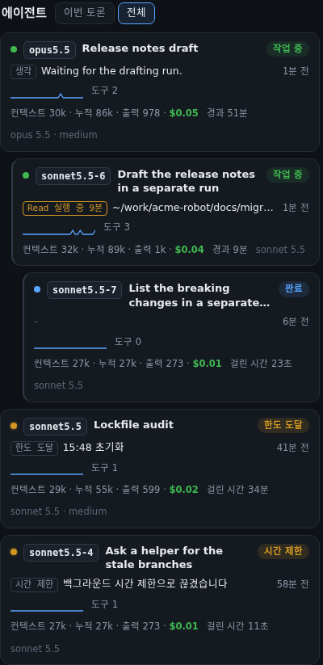

# 화면 설명서

[English](guide.md) · **한국어**

화면 하나하나가 무엇을 뜻하는지 적은 문서입니다. 설치와 실행은 [README](../README.md), 옵션은 [configuration](configuration.md)(영어)을 보세요.

현황판은 Claude Code와 Codex가 디스크에 남기는 기록을 **읽기만** 해서 그립니다. 훅이 필요 없고, 이미 돌고 있는 세션도 바로 보입니다.

| 주소 | 화면 |
|---|---|
| `/` | 현황판 |
| `/game` | 도트 사무실 전체 화면 |
| `/?session=<세션ID>` | 그 세션 열기(`/game`도 같음) |
| `/?session=<세션ID>#agent=<에이전트ID>` | 그 에이전트의 서랍 열기 |
| `/?demo=<이름>`, `/game?demo=<이름>` | 데모 재생(아래 "데모") |
| `/?lang=<코드>` | 화면 언어 고르기(`en`·`ko`. `/game`도 같고, `session`·`demo` 같은 다른 인자와 함께 쓸 수 있음. 아래 "화면 언어와 터미널 언어") |

`/api/…`는 화면이 쓰는 내부 주소이며 예고 없이 바뀔 수 있습니다.

## 화면 구성

| 영역 | 보여 주는 것 |
|---|---|
| 상단 | 프로젝트 선택, 세션 프로세스가 살아 있는지, 작업 중·완료 개수, 있을 때만 나타나는 칩(멈춤 의심·중단됨·알 수 없음·실패 에이전트 수, 진단 — 진단은 누르면 목록이 열림, "진단" 절), 테마·언어 선택기 |
| 알림 | 사용자 판단이 필요한 것만("알림" 절). 없으면 숨음. 머리글에 개수, 브라우저 탭 제목에 `(N)` |
| 에이전트 사무실 | 도트 화면 띠("게임 화면" 절). 1500px보다 좁으면 처음에 접혀 있음 |
| 오케스트레이터 | 작업 중 / 결과 기다림 / 사용 한도 초기화 기다림, 마지막 동작, 지금 컨텍스트 |
| 토큰 사용량 | 공급자(Claude Code / ◆ Codex)별 요약(비용·입력·출력·에이전트 수)과 표(오케스트레이터 / 작업 중 / 끝난 에이전트). 발에는 캐시·호출·모델별 값과 그 공급자에만 있는 것(Claude 조언 모델, Codex 추론·승인 검토·주간 한도) |
| 지금 상황 | 주제마다 한 줄: 몇 라운드인지, 제출 몇 명, 남은 사람 / 다음에 올 주제와 선행 조건 / 멈춤 경고 |
| 사용자 ↔ 오케 | 사용자 지시(오른쪽 보라)와 오케스트레이터 보고(왼쪽)를 시간순 말풍선으로. 선택지 질문과 사용자가 고른 답도 포함. 말풍선을 누르면 전체 내용, "크게"는 넓은 창, "이전 대화 더 보기"는 80개씩 더. 맨 아래를 보고 있으면 새 메시지를 따라가고, 위를 읽는 중이면 "새 메시지 ↓"만 띄움. 사용 한도나 API 오류는 말풍선이 아니라 가운데 흐린 줄로 보임("시스템 줄") |
| 에이전트 대화 | 사무실 카드 오른쪽 카드(아래 "에이전트 대화 카드") |
| 토론 현황 | 주제 카드: 지침 → 1라운드 → 2라운드 → 최종 단계, 참가자 × 라운드 표. 어느 토론 칸에도 없는 작업 중 에이전트는 끝의 "기타 작업" 카드에 |
| 에이전트 | 실시간 카드: 지금 쓰는 도구와 대상, 최근 30분 활동량, 도구 호출 수, 컨텍스트, 모델·effort. 한도나 오류로 멈춘 실행은 이유와 함께 여기에 남고, 다른 에이전트가 띄운 실행은 그 아래 한 칸 들여 서며, 끝의 접힌 묶음 "연결 안 된 하위 실행 N개"는 이 세션에 잇지 못한 실행을 보여 줌("Bash로 띄운 하위 실행" 절) |
| 활동 타임라인 | 에이전트별 줄에 도구 호출(읽기·쓰기·명령·웹), 지시 받음, 보고서 저장, 최종 보고를 시간순으로 |
| 대화 흐름 | 사용자 ↔ 오케스트레이터 ↔ 에이전트 사이 지시·메시지·최종 보고(필터 가능)와 흐린 시스템 줄("시스템 줄" 절) |
| 최하단 줄 | 요금제와 사용 한도("요금제·사용 한도" 절). 70% 이상 노랑, 90% 이상·한도 도달 빨강 |

에이전트 카드나 표의 에이전트 줄을 누르면 오른쪽 서랍에서 첫 지시, 받은 메시지, 최종 보고, 활동 기록, 쓴 문서와 읽은 문서를 봅니다. `/game`에서 인물을 누르면 현황판 서랍이 열립니다. 서버가 30초 안에 답하지 않으면 "연결 끊김"으로 표시하고 다시 시도합니다.

## 화면 언어와 터미널 언어

화면(현황판과 `/game`)은 영어와 한국어를 지원합니다. 화면 언어는 이 순서로 정해집니다.

1. 주소의 `?lang=<코드>`(`en`·`ko`). 모르는 코드는 무시하고 저장하지 않습니다.
2. 머리글의 언어 선택기에서 고른 값. 사용자가 직접 고른 것만 이 브라우저에 기억합니다.
3. 브라우저의 언어 목록(`navigator.languages`) 가운데 지원하는 첫 언어.
4. 영어.

- 선택기(`English`·`한국어`)는 현황판에서는 테마 버튼 옆, `/game`에서는 "현황판으로" 링크 옆에 있고 진단 칸에서도 보입니다. 고르면 그 값을 기억하고, 주소에 `?lang=`을 붙여 화면을 다시 읽으며 주소의 `session`·`demo`와 `#agent=…` 해시를 그대로 둡니다. 현황판과 `/game` 사이 링크도 `?lang=`을 따라갑니다. 설치된 언어가 하나뿐이면 선택기는 숨습니다.
- 번역하는 것은 화면 글(제목·버튼·범례·알림·진단 칸·데모 대사·날짜 형식)뿐입니다. 사용자 지시·보고서·에이전트 설명·모델 이름·경로는 기록 원문 그대로 보입니다.
- 알림을 판정하는 규칙은 화면 언어와 상관없이 한국어·영어 문장을 모두 압니다. 같은 기록은 어느 언어로 봐도 같은 알림을 냅니다.

터미널 출력(시작할 때 요약, 오류 안내, 경고, `--help`)의 언어는 이 순서로 정해집니다.

1. `--lang <코드>`
2. 환경변수 `AGENT_BULLPEN_LANG`
3. `LC_ALL`
4. `LC_MESSAGES`
5. `LANG`
6. 영어

- 먼저 값이 있는 변수가 이깁니다. `LC_ALL=C LANG=ko_KR.UTF-8`은 영어입니다. 빈 값과 `auto`는 없는 것으로 치고, 지원하지 않는 언어(`fr_FR`)는 영어이며 뒤 변수로 넘어가지 않습니다.
- `python3 server.py --help --lang ko`처럼 `--help`도 같은 언어로 나옵니다. `argparse`가 직접 내는 문장(`error: unrecognized arguments` 등)은 늘 영어입니다.
- 403 안내는 영어가 첫 줄, 한국어가 둘째 줄입니다.
- 지원하는 언어는 `static/locales/<코드>.json` 파일 하나가 한 언어입니다. 새 언어를 더하는 법은 [development](development.md)(영어)에 있습니다.

## 첫 화면과 진단 칸

열 세션이 없으면 오류 대신 **진단 칸**이 뜹니다("아직 열 세션이 없습니다"). 공급자(Claude Code, ◆ Codex)마다 한 줄씩 보여 줍니다.

```
Claude Code  ~/.claude/projects   기본 위치          폴더 없음
◆ Codex      ~/.codex/sessions    기본 위치          최근 7일 세션 0
```

| 줄 | 뜻과 할 일 |
|---|---|
| 읽는 폴더 | 설정 폴더 아래 `projects`(Claude) / `sessions`(Codex) |
| 출처 | `기본 위치`, `환경변수 CLAUDE_CONFIG_DIR`·`CODEX_HOME`, `명령 인자 --claude-config-dir`·`--codex-home` |
| 폴더 없음 | 그 도구를 쓰지 않았다면 정상. 기록이 다른 곳에 있으면 위 옵션이나 환경변수로 폴더를 알려 주세요 |
| 세션 0 | 폴더는 있는데 대화가 없음. 대화를 시작하면 5초 안에 나타남. Codex는 최근 7일만 봄 |

- 5초마다 다시 확인하고, 열 세션이 생기면 저절로 엽니다.
- 서버가 꺼졌거나 터널이 끊겼으면 "서버에 연결할 수 없습니다", 연결은 되는데 10초 넘게 답이 없으면 "서버가 응답하지 않습니다"(서버가 기록을 읽느라 바쁘거나 멈춘 것), Host가 허용되지 않았으면 403 본문(고칠 방법 포함), 주소의 세션 id를 못 찾으면 "세션을 열지 못했습니다"가 대신 뜹니다. 앞의 둘은 5초 뒤 다시 시도합니다.
- 한 번 열린 뒤의 끊김은 머리글의 "연결 끊김" 표시로 보입니다.

## 프로젝트와 세션 고르기

- 위쪽 드롭다운은 프로젝트(작업 폴더)마다 한 줄이고, 고르면 그 프로젝트의 **대표 세션**을 엽니다.
- **오케스트레이션**은 서브에이전트가 있는 Claude 세션이거나 Codex 단독 대화입니다. 서브에이전트가 없는 Claude 세션은 **일반 대화(solo)**라고 부릅니다.
- 대표: 오케스트레이션이 있으면 그 가운데 지금 움직이는(2분 안에 기록이 는) 에이전트가 가장 많은 세션(같으면 가장 최근). 한 번 정하면 그 세션 프로세스가 끝나거나 30분 동안 움직임이 없을 때까지 바꾸지 않습니다. 오케스트레이션이 없는 프로젝트는 가장 최근의 일반 대화가 대표입니다.
- 대표가 일반 대화인 프로젝트는 드롭다운의 「일반 대화 · 서브에이전트 없음」 묶음에 "대화 ·"를 붙여 나옵니다. 그런 대화는 오케스트레이터 카드에 "서브에이전트 없는 일반 대화", 토론 칸에는 안내 글이 보입니다.
- 같은 프로젝트의 다른 세션은 오케스트레이터 카드의 "다른 세션 N · 대화 M ▾" 메뉴에 작업 제목으로 나옵니다(오케스트레이션이 먼저, 일반 대화는 뒤 구획).
- 목록에는 에이전트 있는 Claude 세션 최근 30개, Codex 최근 7일, 일반 대화 최근 30개가 들어갑니다. 목록 밖 세션도 주소 `?session=<id>`로는 열립니다.
- 주소에 세션이 없으면 오케스트레이션이 대표인 가장 최근 프로젝트의 대표를 엽니다. 그런 프로젝트가 없으면 가장 최근 일반 대화입니다(`--session`을 줬으면 그것).

## 알림

| 등급 | 언제 | 근거 |
|---|---|---|
| 결정 필요 | 오케스트레이터가 선택지를 물었는데(AskUserQuestion) 답이 아직 없다 | 기록에서 확인 |
| 결정 필요 | 오케스트레이터가 턴을 끝냈고 마지막 두 줄이 질문·결정 요청이다("?", "원하시면", "승인하시면", "말씀해 주시면", 영어는 "let me know", "would you like", "should I", "please confirm" 등) | 발언으로 추정 |
| 확인 필요 | 최근 12시간 에이전트 보고에 "사용자 결정 / 승인 항목 / 결정 필요" 같은 줄(영어는 "user decision", "needs your approval", "decision needed" 등)이 있다(그 줄을 보여 줌) | 기록에서 확인 |
| 확인 필요 | 에이전트가 멈춤 의심이거나 최근 24시간 안에 실패·중지됐다 | 상태 판정 |
| 확인 필요 | 에이전트나 오케스트레이터가 사용 한도로 멈췄다: 초기화 시각이 같은 것 전부에 알림 하나("사용 한도 도달 — 15:03에 초기화", 기록에 시각이 없으면 "초기화 시각 모름") | 기록에서 확인 |
| 확인 필요 | Codex 에이전트가 일하는 중이고 Codex 주간 한도(계정 전체)가 90% 이상이거나 도달했다 | 기록에서 확인 |
| 사용자 차례 | 도는 에이전트가 없고 오케스트레이터가 턴을 끝냈다. 오케스트레이터가 저절로 이어질 한도를 기다리는 동안은 나오지 않는다 | 기록에서 확인 |
| 참고 | 초기화 뒤 저절로 이어지는 실행이면 위의 사용 한도 알림("… 15:03에 자동 재개"). 사용자가 할 일은 없다 | 기록에서 확인 |

- "확인함"을 누르면 그 알림을 이 브라우저에서만 숨깁니다. 답은 오케스트레이터가 돌고 있는 창(터미널 등)에서 합니다.
- API 오류·시간 제한·중도 종료로 멈춘 실행, 끝난 실행, 알 수 없는 상태는 따로 알림을 내지 않습니다. 에이전트 목록과 머리글 칩에 보입니다("상태 판정" 절).
- 발언으로 추정하는 규칙은 틀릴 수 있습니다. 놓치거나 더 잡을 수 있습니다.
- 영어도 같은 방식으로 잡습니다. 사용자에게 선택·답·승인을 청하는 문장(`?`, `let me know`, `would you like…`, `should I`, `please confirm/approve/choose`, `needs your approval`, `decision needed` 등)이 대상이고, 지난 일("I approved")이나 일반 안내("if you want to change the port, pass --port"), 부정("does not need your approval")은 잡지 않습니다.

## 에이전트 대화 카드

사무실 카드 오른쪽에 붙는 카드(폭 380px, 1300px 미만이면 사무실 아래)입니다. "사용자 ↔ 오케"와 같은 말풍선으로, 대화인 사건 여섯 가지만 보입니다.

| 사건 | 모양 |
|---|---|
| `spawn`(작업 배정)·`orch_msg`(메시지) | 오케스트레이터 → 에이전트, 왼쪽 주황 |
| `handback`(최종 보고)·`peer`·`agent_msg`(오케스트레이터에게) | 에이전트 → 오케스트레이터, 오른쪽 청록 |
| `agent_msg`(다른 에이전트에게) | 가운데 파랑 |
| `xread`(교차 검토) | 흐린 한 줄 |

- 필터 탭: 전체 · 오케↔에이전트 · 에이전트끼리. 고른 탭은 이 브라우저에 기억됩니다.
- 이름은 사무실·토론 현황과 같은 규칙입니다(역할 이름 `T1-A` + 모델 `opus5.5`, Codex는 ◆).
- 이름을 누르면 에이전트 서랍, 말풍선을 누르면 전체 글, "크게"는 넓은 창, "이전 대화 더 보기"는 80개씩 더.
- 항목에 마우스를 올리면 사무실에서 보낸 사람과 받는 사람의 발밑에 고리가 생깁니다(사무실에 없는 사람이나 데모 재생 중에는 없음).
- `/game`에는 이 카드가 없습니다.

## 토론 표의 칸

| 표시 | 뜻 |
|---|---|
| ✓ 제출 | 보고서 파일이 있고 맡은 에이전트가 그 라운드를 끝냈다. 누르면 문서를 연다. "읽음: T3-B·T3-C"는 그 보고서를 읽은 다른 에이전트(교차 검토) |
| ✎ 초안 | 파일은 있지만 에이전트가 아직 그 라운드를 쓰고 있다 |
| ✎ 중단됨 · 초안 있음 | 파일은 있지만 에이전트가 중단됐거나(한도나 오류) 상태를 알 수 없어서 아무도 쓰고 있지 않다. 그 라운드는 아직 열린 것으로 친다 |
| ✎ 작성 중 | 배정됐고 에이전트가 돌고 있지만 파일이 아직 없다 |
| ⏸ 중단 | 에이전트가 파일을 저장하기 전에 중단됐다(한도나 오류). 그 라운드는 아직 열린 것으로 친다 |
| ! 미제출 | 에이전트가 끝났는데 파일이 없다 |
| 대기 | 아직 배정 전 |

참가자 줄에는 상태 아래에 공급자·모델·effort가 한 줄로 나옵니다(`Claude Code · Opus 5.5 · xhigh`, `◆ Codex · gpt-6.1-sol · high`). 주제 카드의 최종 칸은 최종안이 있으면 "최종안 완료"이고 누르면 문서가 열립니다. 최종안을 찾는 규칙은 "토론을 알아보는 방법" 절에 있습니다.

## 게임 화면

현황판의 "에이전트 사무실" 띠와 `/game`(전체 화면)은 같은 그림을 같은 데이터로 그립니다. 범례는 두 곳 모두 그림 아래에 있습니다. 창이 가려지거나 띠를 접으면 그리지 않습니다.

**배치** (왼쪽부터): 사용자 사무실(붉은 카펫, 왕관 쓴 사용자) → 지휘실(오케스트레이터, 모니터와 노트북) → 토론 주제마다 방(게시판에 라운드 칸: 초록 = 제출, 파랑 = 작성 중, 회색 = 대기) → 휴게실. 이동은 늘 문 → 복도(→ 줄을 잇는 세로 통로) → 목적지 방 문 → 자리 순서입니다.

**누가 어디에**
- 작업 중인 에이전트는 자기 책상에서 타자를 칩니다. 끝나면 휴게실에서 쉬고(다음 지시 대기), 다시 일을 받으면 책상으로 걸어갑니다. 새로 배정된 에이전트는 건물 입구로 들어옵니다. 중단된 에이전트도 일시정지 아이콘을 달고 휴게실에서 쉬며, 마우스를 올리면 초기화 시각이나 이유가 보입니다.
- 사용 한도 초기화를 기다리는 오케스트레이터는 책상에서 졸고, 지휘실 벽 간판에는 "15:03 재개"·"15:03 초기화"·"사용 한도"가 나옵니다. 새 한도 줄은 말풍선으로 말하고, 다른 시스템 줄은 조용합니다.
- 다른 에이전트가 띄운 실행은 둘 다 "기타 작업" 방에 있을 때 부모 옆자리에 앉습니다.
- 끝난 주제는 방을 뺍니다: 작업 중인 사람이 없고 최종안이 나온 지 20분이 지났거나, 참가자가 없는 주제. 그 사람들은 "지난 에이전트 N명"으로 셉니다. 토론 현황 카드에는 모든 주제가 남습니다.
- 사용자가 지시하면 머리 위에 "!"가 뜨고 오케스트레이터가 사용자 사무실로 가서 듣습니다. 오케스트레이터가 보고하거나 선택지(AskUserQuestion)로 물을 때도 사용자 사무실로 갑니다("?" 표시).
- 오케스트레이터 → 에이전트 메시지는 편지가, 최종 보고는 문서가 날아갑니다. 교차 검토(다른 참가자의 `r<N>/<X>.md`를 읽음)는 작성자 → 읽는 사람으로 문서가 날아가고, 에이전트가 다른 에이전트에게 SendMessage를 보내면 받는 사람 옆으로 걸어가 말풍선으로 전합니다.

**휴게실**: 쉬는 사람은 150초(데모는 20초)마다 시설을 골라 쓰고, 칸이 바뀌면 걸어서 옮깁니다. 시설은 소파·티 테이블·게임기·러닝머신·덤벨·커피 머신이고, 폭에 맞춰 개수가 정해집니다(6명마다 소파 단위 하나, 최대 24명 기준). 자리가 없으면 "+N명 더"로 셉니다. 끝난 지 30분이 넘은 사람은 소파를 더 고르고, 소파에서 졸기도 합니다. 실패·중지·종료한 사람은 소파를 먼저 잡습니다(상태 아이콘은 그대로).

**글자와 아이콘**
- 책상 앞판의 황동 명패에 자리 글자(`A`·`B`, `codex1`), 책상 아래 이름표에 상태 점 · 모델(`opus5.5`) · 역할. 전체 설명은 마우스를 올리면 보입니다.
- 머리 위: 책 = 읽기, 연필 = 쓰기, 검은 창 = 명령 실행, 지구 = 웹, 편지 = 지시 받음, … = 생각, ? = 멈춤 의심·알 수 없음, ‖ = 중단(마우스를 올리면 초기화 시각이나 이유), ! = 실패. Codex는 안쪽 도구 이름으로 같은 아이콘을 고릅니다.
- **모니터 기호**가 자리의 공급자를 보입니다(로고가 아니라 중립 기호): Claude Code는 주황 `>_`, Codex는 흰 ◆. 쉬는 자리는 꺼진 화면에 기호만, 작업 중에는 초록 코드 줄이 흐르고 기호가 비칩니다. 사용자 책상과 배정 전 빈 자리에는 기호가 없습니다.
- Codex 에이전트는 검은 뿔테 안경을 쓰고 이름표 점이 ◆입니다.
- 인물은 앞·뒤·옆 네 방향 그림이 있고, 가는 방향을 보고 걷습니다.

**말풍선**은 요약이 아니라 기록에 있는 문장을 규칙대로 줄인 것입니다: 메시지의 `summary` 필드, 보고·발언의 첫 문장(56자), 경로는 끝 두 단계만. 한 번에 4개까지, 8초 뒤 사라지고, 에이전트 발언은 한 명당 25초에 한 번까지입니다.

**화면 규칙**
- 현황판 띠는 한 줄을 지키려고 배율을 조금 줄입니다(최소 1.5배). 전체 화면은 정수 배율이고 창 높이에 맞춰 여러 줄로 접힙니다.
- 서버가 다시 켜지면 화면은 사건 번호를 새로 세고, 지난 사건을 다시 틀지 않습니다.
- 글꼴 Galmuri는 저장소에 들어 있어(`static/fonts/`) 인터넷이 필요 없습니다.
- 스크롤바는 늘 보이고, 3초마다 다시 그려도 스크롤 위치는 그대로입니다.

### 데모

"▶ 데모" 버튼으로 시나리오를 골라 화면 안에서만 재생합니다. 서버와 기록은 그대로입니다. 주소로도 엽니다: `/game?demo=<이름>`, `/?demo=<이름>`(`1`은 basic). **세션이 하나 열려 있어야** 합니다(데모는 열린 세션의 사무실 위에 그립니다. 세션이 없는 진단 칸 화면에서는 버튼이 숨고 데모도 시작하지 않습니다).

| 이름 | 시나리오 | 길이 | 보여 주는 것 |
|---|---|---|---|
| `basic` | 토론 한 바퀴 | 80초 | 교차 검토, 동료 찾아가기와 답장, 사용자 요청·보고, 휴게실에서 복귀, 모두 끝나 휴게실에서 흩어짐 |
| `new` | 새 주제 시작 | 55초 | 사용자 요청 → 3명이 입구로 들어와 배정 → 자료 읽기·초안 → 차례로 제출 → 사용자에게 보고 |
| `round2` | 2라운드 교차 검토 | 65초 | "2라운드 시작" 편지 → 서로의 1라운드 보고서 읽기 → 반박·재반박 → 2라운드 제출 → 보고 |
| `trouble` | 문제 상황 | 56초 | 멈춤 의심(?) → 실패(빨간 !) → 사용자에게 결정 요청(현황판은 알림 창) → 새 에이전트로 다시 띄움 |
| `talk` | 에이전트끼리 토론 | 57초 | 같은 방·다른 방 동료와 질문·답장, 합의를 오케스트레이터에게 → 사용자에게 보고 |
| `all` | 전부 이어서 | 약 5분 | 위 다섯 가지를 차례로("다음 ▶"으로 건너뜀) |

`new`·`round2`·`trouble`·`talk`는 데모 전용 방(T9)과 가짜 에이전트를 화면 안에서만 만들어 쓰므로 실제 데이터가 어떤 상태든 똑같이 재생됩니다. 재생 중에 온 실제 갱신은 모아 두었다가 끝나면 반영합니다.

## Codex

Claude만 있는 세션은 아무것도 달라지지 않습니다. 표시는 Codex 쪽에만 붙습니다.

| 무엇 | 어떻게 |
|---|---|
| 구별 | 현황판은 모양 ◆(상태 점·이름 앞 글자), 사무실은 안경·모니터의 흰 ◆·이름표 ◆ 점. 색은 상태 그대로 |
| 섞인 팀 | Claude가 Bash로 띄운 `codex exec`를 그 세션의 에이전트로 붙입니다(서브에이전트가 띄웠으면 그 아래에). 스레드 하나 = 에이전트 하나, 턴 = 받은 지시, 턴의 마지막 답 = 최종 보고. `-o <파일>`의 내용이 마지막 답과 같으면 그 파일의 작성자로 토론 표에 들어갑니다 |
| 이름 | 보고서 이름(`codex1`), 없으면 모델 이름(`gpt-6.1-sol` → `sol6.1`). 같은 모델이 여럿이면 띄운 순서대로 `sol6.1`, `sol6.1-2`, … |
| 단독 세션 | TUI·Desktop·연결 못 한 exec(최근 7일)는 Claude 세션과 같은 오케스트레이션으로 프로젝트에 들어갑니다. 사무실은 청회색 카펫의 "지휘실 · Codex" |
| 토큰 | Codex 입력에는 캐시 읽기가 들어 있어 나눠서 Claude와 같은 뜻으로 셉니다. 추론 토큰은 출력 안에 있고(서랍에 "그중 추론"), 승인 검토(`codex-auto-review`)는 부모 스레드에 들어가 서랍에 "승인 검토 N회"로 보입니다. 창은 258k |
| 큰 기록 | 64 MB가 넘는 rollout은 끝 64 MB만 활동으로 읽고(서랍에 "끝부분만 읽음") 누적 토큰은 마지막 합계로 맞춥니다 |
| 읽지 않는 것 | Codex sqlite, `auth.json`, `config.toml`, `history.jsonl`, 계정 식별자 |

**`codex exec`를 세션에 잇는 규칙** — 실행 자리의 `codex exec`만 봅니다(인용·heredoc·주석 속 글자, `bash -c '…'`·`eval` 안쪽의 인용은 실행이 아님. `cd`는 순서대로 따라감). 아래 가운데 하나가 맞으면 잇습니다.

1. 지시문이 Codex 첫 메시지와 일치(변수 칸 제외 40자 이상, 30초 안, 작업 폴더 같음)
2. 실행한 명령 안에 스레드 id가 있음
3. 지시문이 짧을 때 시간 + 작업 폴더로 후보가 하나뿐이면 "추정"
4. 반복문처럼 호출과 스레드의 짝을 모를 때, 스레드 시작 30초 안에 Codex를 실행한 Claude 세션이 하나뿐이면 그 세션의 에이전트("추정")

여러 세션이 겹치면 잇지 않고 단독으로 둡니다.

## 요금제·사용 한도

맨 아래 줄은 계정 전체의 요금제와 사용 한도입니다. Claude Code와 ◆ Codex를 같은 순서로 보입니다(요금제 → 5시간 → 주간 → 추가 사용·크레딧 → 기록 시각).

| 서비스 | 요금제 | 5시간·주간 사용률 |
|---|---|---|
| Claude Code | `.claude.json`의 요금제 등급 | **기본**: `.claude.json`에 Claude Code가 남겨 둔 캐시(`/usage`를 열 때 갱신)를 회색 "기록 HH:MM · /usage로 갱신"으로 보입니다. 캐시가 없으면 "Claude Code에서 /usage를 열면 보입니다" 한 줄. 인증 파일을 읽지 않고 외부 호출도 하지 않으며 노랑 오류도 없습니다. **`--claude-usage-api`를 켜면** 아래 문단대로 직접 조회합니다. |
| Codex | rollout의 `rate_limits.plan_type` | `primary`(주간)·`secondary`(5시간) 가운데 가장 늦은 기록. Codex를 쓸 때마다 갱신됩니다. 5시간 창이 없는 요금제도 있습니다 |

색: 70% 이상 노랑, 90% 이상·한도 도달 빨강. 재설정 시각이 지난 값은 "한도 도달"이나 사용률 대신 `—`(추정 재설정 시각)으로 보입니다. 대화 기록의 한도 도달(`quotaLimits`)은 도달 뒤에 읽은 사용률이 100% 미만이면 지난 것으로 봅니다.

**`--claude-usage-api`를 켠 경우**(비공식 API, 사용자 책임 — [README의 보안 절](../README.md#보안과-개인정보)): 60초마다 Claude 설정 폴더(기본 `~/.claude`, `CLAUDE_CONFIG_DIR`로 바꿈)의 `.credentials.json`에 있는 현재 access token으로 계정 사용량 API를 조회하고 "조회 HH:MM"으로 보입니다. 토큰을 새로 발급하지 않고 화면·응답·로그에 내보내지 않습니다. 토큰이 만료됐거나 조회가 실패하면 사유를 노랑으로 보이고 캐시 값으로 돌아갑니다. 이 API는 1분 간격이면 한 번 걸러 429를 주므로 값은 사실상 2분마다 바뀌고, 429는 마지막 값이 3분 안이면 숨깁니다. API가 실제로 답한 뒤에는 마지막 값과 조회 시각을 `$XDG_CACHE_HOME/agent-bullpen/usage.json`(없으면 `~/.cache/agent-bullpen/usage.json`, 권한 0600)에 남겨 재시작 직후에도 값을 보입니다(로그인 정보가 없어 부르지 못했으면 파일도 만들지 않습니다).

**macOS 등 로그인 정보가 파일에 없는 경우**: Claude Code가 로그인 정보를 `.credentials.json`이 아닌 곳에 두면(macOS는 보통 키체인) 읽을 토큰이 없습니다. 이 도구는 키체인을 읽지 않으므로 하단 줄은 캐시 값("기록 HH:MM")을 그대로 보이고 노랑 "로그인 정보 없음"만 덧붙습니다. 그때는 `--claude-usage-api`를 빼도 됩니다.

계정 식별자·이메일·토큰은 화면으로 내보내지 않습니다.

## Bash로 띄운 하위 실행

Claude 세션이나 그 에이전트가 Bash로 `claude -p …`(또는 `--print`)를 실행하면, 그때 새로 생긴 Claude 세션을 띄운 세션의 **하위 에이전트**로 붙입니다. 세션 목록에는 따로 나오지 않고 부모 세션의 에이전트 수에 셉니다. 띄운 에이전트는 그 명령이 들어 있는 기록의 주인입니다. 서브에이전트가 띄운 자식은 그 서브에이전트 아래에, 자식이 띄운 자식(`claude -p` 안의 `claude -p`)은 그 자식 아래에 단계마다 한 칸씩 들여 놓습니다(최대 4단계). 부모가 화면 목록에 없으면(예: "이번 토론" 필터) 혼자 서고 "↳ … 띄움" 줄이 붙습니다.

**어떻게 잇나.** 증거에 순위를 매기고, 답이 하나로 나오는 가장 높은 순위가 정합니다. 어느 세션이 띄웠는지(트리)와 그 세션 안의 어느 에이전트가 띄웠는지(노드)는 따로 정합니다.

| 증거 | 규칙 이름 | 화면 표시 |
|---|---|---|
| 띄운 명령의 출력 파일(`> out.json`, `-o`)에 이 실행의 세션 id가 들어 있거나, 명령 글에 그 id가 있음(`--session-id`, `--resume`) | 출력 파일 · id | 확실 |
| 살아 있는 프로세스: 부모 프로세스를 거슬러 올라가면 그 세션이거나, 환경의 `CLAUDE_CODE_SESSION_ID`·`CLAUDE_PID`가 가리킴. 또는 `links.json`에 남겨 둔 연결. 세션만 정하고, 그 안의 어느 에이전트인지는 명령에서 읽으며 못 읽으면 메인 세션으로 둡니다 | 프로세스 계보 · 환경변수 · 저장해 둔 연결 | 확실 |
| 자식의 첫 지시문(따옴표·역슬래시·공백을 무시하고 32자 이상)이 자식이 시작할 때 실행 중이던 명령의 글, 또는 그 명령이 쓴 파일에 들어 있음 | 지시문 일치 | 확실 |
| 같은 맞춤인데 지시문이 더 짧음 | 짧은 지시문 | 추정 |
| 같은 맞춤인데 그 세션에서 자식을 띄웠을 수 있는 명령이 읽지 못한 스크립트뿐임(없는 파일·너무 큰 파일·이진 파일·변수에 기댄 경로) | 추정(띄운 스크립트를 읽지 못함) | 추정 |
| 시간과 폴더만 맞음: 자식이 시작하기 직전 그 폴더에서 실행된 명령 하나 | 추정(시간+cwd) | 추정 |

- "실행 중"은 명령이 시작했고 아직 끝나지 않았다는 뜻이며, 끝난 뒤 10초는 봐줍니다. 정해진 시간 창은 없습니다.
- 명령의 글자 인자가 자식의 첫 지시문과 다르거나, 다른 폴더에서 실행됐거나, 글만 찍는 명령(`echo`, `printf`)이거나, 세션 기록을 남기지 않게 한 명령(`--no-session-persistence`)이면 후보에서 뺍니다.
- 기록에 지시문 글만 들어 있고(글을 파일이나 메시지에 썼을 뿐) 세션을 띄울 수 있는 것을 실행한 적이 없는 세션은 띄운 쪽으로 치지 않습니다. 다른 증거가 없으면 그 자식은 연결 없이 남고, 진단에 그 세션을 가리키는 `content_author_differs`가 나옵니다.
- 두 세션이나 두 명령이 똑같이 맞으면 잇지 않고, 시간으로 비김을 깨지 않습니다. 그 자식은 에이전트로 나오지 않고 아래 "연결 안 된" 묶음에 보입니다.
- 변수에 기댄 경로는 그 명령·스크립트 안에서만 풀고 폴더를 뒤져 찾지 않습니다. 풀지 못한 경로는 진단에 `path_unresolved`로 나옵니다.
- 서버를 시작한 뒤 몇 초 동안은 지시문 일치로 이은 연결이 추정으로 보이고, 서브에이전트나 다른 실행이 띄운 실행은 목록에 아직 없을 수 있습니다. 글을 맞춰 보는 뒤 단계는 첫 화면을 만든 뒤에 시작하고(늦어도 시작 10초 뒤), 끝나면 연결이 확실로 바뀌고 빠졌던 실행이 나타납니다.
- 에이전트 서랍에는 `claude -p` 실행과 Codex 스레드에 "연결: <규칙> · 확실|추정"이 나옵니다. 마우스를 올리면 이유가 보입니다. 짧은 지시문 추정은 세 이유 가운데 어느 것인지(짧은 지시문, 글 비교가 크기 한도에서 멈춤, 띄운 스크립트를 읽지 못함)를 라벨과 설명에 밝힙니다. 일반 서브에이전트 호출로 시작한 것은 따로 표시하지 않습니다.

**이어 받은 실행.** 자식은 `--resume`이나 메시지로 이어질 수 있고, 그래도 에이전트는 하나입니다. 서랍에 "실행 N번"과 실행마다 어떻게 시작했는지(첫 시작 · 새 프로세스 · 메시지로 재개)와 누가 지시했는지("지시: 오케스트레이터" 또는 에이전트 이름)가 나옵니다. 뒤 지시를 준 쪽은 처음 띄운 쪽과 다를 수 있고, 부모는 바뀌지 않습니다.

**연결 안 된 것.** 에이전트 목록 끝의 접힌 묶음 "연결 안 된 하위 실행 N개"는 이 세션의 Bash 호출 직후 1분(Codex는 30초) 안에 시작했지만 그 호출에 잇지 못한 세션을 보여 줍니다. 세션마다 최대 20개, 14일 안에 시작한 것, 최근 순입니다. 이유도 함께 나옵니다: 맞는 명령이 실행됐지만 이 실행에 연결하지 못함(비김) · 실행 중이지만 이 세션의 명령 중 맞는 것이 없음 · 현황판이 프로세스를 보기 전에 끝남. 없으면 아무것도 나오지 않습니다.

**기억해 둔 연결.** 연결 기록 파일 `$XDG_CACHE_HOME/agent-bullpen/links.json`(없으면 `~/.cache/agent-bullpen/links.json`, 권한 0600)은 확실한 연결만 남겨 재시작해도 잊지 않게 합니다. 연결마다 자식·부모 세션 id, 규칙(`proc`·`env`·`out`·`content`), 처음 본 시각, 서브에이전트가 띄운 자식이면 서브에이전트 id만 들어 있고 지시문·경로·환경 값은 없습니다. 최대 2000개, 90일까지이고 넘으면 오래된 것부터 지우며, 파일은 2 MiB까지 읽습니다. 추정(짧은 지시문·읽지 못한 스크립트·시간)은 남기지 않습니다. 첫 확실한 연결을 찾은 뒤에야 만들어지고, 기억만 해 둔 연결은 "저장해 둔 연결"이나 "기억된 연결"로 보이며 확실로 칩니다. 기록이나 프로세스가 말하는 것을 거스르지 못합니다. 일반 파일이 아니거나, 다른 사용자 소유이거나, 다른 사용자가 쓸 수 있거나, 형식이 잘못됐으면 무시하고 진단에 `cache_error`가 나옵니다. `--no-link-cache`를 주면 읽지도 쓰지도 않습니다.

- 세션 파일의 pid가 다른 프로세스에 재사용됐거나(`procStart`가 다름) 다른 사용자·다른 pid 이름공간의 것이면, 기록이 없으면, 사용자가 같은 세션을 따로 열었으면 잇지 않습니다. `/proc`이 없는 곳(macOS)은 Codex 쪽은 "모름", Claude 쪽은 `ps`로 부모만 따라가고 프로세스 소유자(`ps -o uid`)는 비교하지만 시작 시각은 비교하지 못합니다.
- 떼어서 띄운 자식(`setsid nohup claude -p … &`)은 부모가 init(pid 1)이라 조상으로는 못 찾지만, Bash 도구가 띄운 프로세스의 환경에는 띄운 Claude의 세션 id(`CLAUDE_CODE_SESSION_ID`)와 pid(`CLAUDE_PID`)가 남아 있습니다. 살아 있는 `claude -p` 자식과 Codex 프로세스의 environ에서 **이 두 값만** 읽습니다(나머지 환경 값은 저장·로그·응답 어디에도 남기지 않습니다). 환경의 세션 id가 그 프로세스 자신의 세션이거나, `CLAUDE_PID`가 가리키는 살아 있는 Claude의 세션이 그 id와 다르면(세션을 바꿨다) 쓰지 않습니다. Linux는 `/proc/<pid>/environ`, 그 밖은 `ps -E`로 같은 사용자 프로세스만 읽고 안 되면 "모름"입니다.
- 반복문 한 줄(`for x in a b c; do … claude -p … & done`)이 띄운 여러 자식: 반복 수를 알면(`for x in a b c`, `{1..5}`, 겹친 반복문은 곱해 64까지) 반복마다 하나, 모르면(`while`·`until`·`$(…)`·글롭) 몇 개든 될 수 있습니다. 명령은 자기가 시작할 수 있는 수보다 많은 자식을 가질 수 없어서, 그 밖의 닮은 자식은 잇지 않습니다.
- 스크립트 읽기: Bash 명령이 명령 자리에서 스크립트 파일을 돌리면(`bash`·`sh`·`zsh`·`source`·`.`·`./파일`·경로 실행) 그 파일 안의 `claude -p`·`codex exec`도 위 규칙으로 봅니다(작업 폴더는 그 호출의 `cd` 범위 기준, `$HOME`·위치 인자·`VAR=값`은 스크립트 안에서만 풉니다). 1단계만이라 스크립트가 부르는 스크립트는 따라가지 않습니다. 문서 보기와 같은 정책으로 열어 일반 파일만, 256 KB까지, 점 경로·비밀 이름은 읽지 않고, 읽을 수 없으면 조용히 넘어갑니다. 읽지 못한 스크립트는 세션을 띄울 수도 아닐 수도 있으므로, 그 세션의 글에서 지시문을 찾아도 확실한 연결이 아니라 추정만 만듭니다.
- 세션 기록을 전혀 남기지 않은 띄운 명령(지워진 기록, `--no-session-persistence`)은 진단에 `orphan_launch`로만 나옵니다. 그것을 위한 카드도 자리도 만들지 않습니다.
- 역할 태그가 없으면 모델 이름(`opus5.5`…)을 쓰고 같은 모델끼리는 띄운 순서대로 번호가 붙으므로, `claude -p` 세션이 끼면 같은 세션의 다른 에이전트 번호가 밀릴 수 있습니다.
- 대화: 하위 세션의 첫 사용자 지시가 `spawn` 사건의 본문이 되고, `--resume`으로 이어 준 지시는 `orch_msg`, 한 턴이 `end_turn`으로 끝날 때의 마지막 어시스턴트 글은 `handback`으로 나옵니다. "에이전트 대화" 카드에서 읽습니다.
- 토론 칸 배정은 바뀌지 않습니다(이름은 화면용).

## 토론을 알아보는 방법

디스크에 있는 폴더에 보고서가 `<주제 폴더>/r<N>/<참가자>.md` 꼴로 놓여 있으면 토론으로 봅니다.

```
research/                    ← 공통 지침(선택): 제목, 주제 표
  brief.md
  t1_naming/                 ← 주제 폴더
    brief.md                 ← 주제 지침: "# 제목"과 "**A — 역할**" 줄
    r1/A.md  r1/B.md         ← 1라운드 보고서(참가자마다 하나)
    r2/A.md  r2/B.md         ← 2라운드
    rulings.md               ← 최종안(자동 인식)
  final/t2_api.md            ← 표로 지정한 최종 산출물
```

**어떤 것이 토론인가.** 디스크에 있는 폴더이고 라운드 폴더(`r1`·`r01`·`round1`)나 `brief.md`가 들어 있는 것입니다. `README.md`·`index.md`는 라운드 폴더 옆에 있을 때만 지침으로 칩니다. 폴더는 에이전트의 일이 가리키는 경로(그 폴더와 위쪽 폴더를 확인)에서 찾고, 백그라운드에서 1분쯤마다 세션이 일하는 저장소의 맨 위를 걸어서도 찾습니다(`/tmp`, HOME 전체, 저장소 여러 개를 담은 폴더는 걷지 않습니다. 걷기에는 예산이 있고 다 쓰면 진단에 `listing_capped`가 나옵니다). 지시문에 이름만 나오고 디스크에 없는 폴더는 토론이 되지 않습니다.

**에이전트가 자리를 얻는 법**
- 보고서 경로는 에이전트에게 준 첫 지시·`SendMessage` 본문(절대 경로나 `~/…`), 에이전트가 실제로 쓴 파일, 그리고 두 가지 명령에서 찾습니다. 에이전트를 띄운 명령이 출력을 파일에 쓰면(`> r1/B.md`, `-o r1/B.md`), 지시문이 그 라운드의 보고서를 말할 때는 그 보고서와 전체 경로가 같을 때만(라운드 폴더 철자도 같아야 함) 씁니다. 그래서 보조 `-o B_last.md`나, 지시문은 `r1/B.md`인데 출력이 `r01/B.md`인 경우는 별개의 파일이라 자리를 주지 않습니다. 지시문이 보고서를 말하지 않으면 그 출력 파일이 증거입니다. 그리고 에이전트가 직접 실행한 Bash 명령이 리디렉트(`>`, `>>`)·`tee`·heredoc(`cat > r1/B.md <<EOF`)으로 파일을 쓰면 Write·Edit와 같은 쓰기입니다(Claude 에이전트의 Bash만 읽고, Codex 에이전트가 직접 실행한 명령은 읽지 않습니다).
- 상대 경로("`r2/A.md`를 쓴다")는 여러 기준(에이전트의 폴더, 띄운 세션의 폴더, git 최상위)으로 풀어 보고 실제로 있는 토론 폴더와 맞춰 봅니다. 하나가 맞으면 그것을 씁니다. 맞는 것이 없으면 버리고, 여럿이 맞으면 자리를 주지 않고 진단에 `path_ambiguous`가 나옵니다. 풀 수 없는 변수를 쓴 경로는 `path_unresolved`입니다.
- 자리는 강한 순서로: 에이전트가 쓰라고 받은(또는 에이전트를 띄운 명령이 위처럼 쓰는) 경로 → 지시문 앞 300자 안의 `T1-A` 같은 표지 → 자기 보고서를 성공적으로 쓴 것 → 설명 앞의 태그(성공한 쓰기가 뒷받침할 때만이며, 보고서를 그냥 언급했거나 풀지 못한 경로는 아님)입니다. 쓰기가 성공했다는 것은 Write·Edit의 결과가 오류가 아니거나, Bash의 리디렉트·`tee`·heredoc이 오류 없이 끝나고 파일이 있다는 뜻입니다. 보고서를 읽기만 한 사람, 인용("문서 속의 '결과를 …에 쓴다'"), 부정("쓸 필요 없다"), 인용되거나 부정된 표지, 실패한 쓰기는 자리를 주지 않습니다. 표지는 토론 하나에만 앉습니다. 에이전트는 한 칸에 파일 하나만 갖습니다. 한 칸에 대한 주장이 서로 다른 두 파일을 가리키면 더 강한 쪽이 자리를 지키고, 같은 세기면 비워 둡니다(`alias_collision`). 한 라운드에 폴더가 둘(`r01`과 `r1`)이면 표지나 태그만으로는 고를 수 없어 이때도 비워 둡니다.
- 둘 다 살아 있는 두 에이전트에게 같은 자리가 똑같이 맞으면 비워 둡니다(`seat_tie_held`). 앞 에이전트가 끝났으면 뒤 에이전트가 넘겨받습니다. 자리는 철자를 그대로 지키고(`r01`·`round1`·`b.md`·`A_flow.md`), 한 보고서 이름에 서로 다른 파일 둘이 있으면 합치지 않습니다(`alias_collision`).
- 토론 폴더에서 일하지만 자리가 없는 에이전트는 "기타 작업"에 나오고 진단에 `debate_in_misc`가 나옵니다.
- **라운드 없는 검토**(지침은 있고 라운드 폴더는 없는 폴더)는 지침이 검토자와 각자의 결과 파일을 밝혔을 때만 칸이 생깁니다(검토자 이름과 `<이름>.md`가 같은 줄에 있음). 그 칸에는 라운드가 없습니다. 그런 선언이 없으면 제목만 보이고 진단에 `declaration_missing`이 나옵니다. 자리나 라운드를 지어내지 않습니다.
- Codex는 역할 태그가 없으므로 지시문에서 "쓴다·작성·저장·write"가 붙은 보고서 경로를 그 에이전트의 칸으로 봅니다. `-o` 파일과 실제로 쓴 파일도 씁니다. Codex의 작업 폴더는 상대 경로를 푸는 기준 하나가 더 됩니다.
- 문서 보기(`/api/file`)는 토론 목록보다 엄격해서 `brief.md`나 `r<N>/`가 있는 폴더만 엽니다("제한" 절).
- 주제 폴더와 부모 폴더에 모두 `brief.md`가 있고 부모에 라운드 폴더가 없으면 부모를 토론 하나로 묶습니다(`research/` 아래 `t1_…`, `t2_…`).

**이름과 역할**: 주제 이름은 주제 `brief.md`의 첫 제목, 역할은 `**A — 역할**` 표기(대문자 한 글자, 줄표, 그다음 누구인지 말하는 글)에서 읽습니다. 편집 지침에 굵게 적은 `**C-23**` 같은 번호는 참가자가 아니라서 줄을 만들지 않습니다. 없으면 폴더 이름만 씁니다. 화면에 보이는 에이전트 이름은 그 태그(Codex는 보고서 이름)이고, 태그가 없으면 모델 이름(`opus5.5`, `sol6.1`)입니다. 이 이름은 화면용이라 칸 배정에는 쓰지 않습니다.

**최종안**은 둘 중 하나로 찾습니다.

1. 공통 `brief.md`의 표. 첫 줄은 머리글이고, 폴더 칸이 `` `t1_naming/` `` 꼴이며 최종 산출물 칸이 `` `final/…` `` 꼴인 줄을 읽습니다(칸의 위치는 상관없음). "선행 조건"은 머리글에 `선행`이나 `depend`가 든 열에서 읽습니다.

   ```
   | 주제 | 폴더 | 선행 | 최종 산출물 |
   |---|---|---|---|
   | 이름 짓기 | `t1_naming/` | — | `final/t1_naming.md` |
   | API 모양 | `t2_api/` | t1 | `final/t2_api.md` |
   ```

2. **자동 인식**: 표에 그 주제가 없으면, 주제 폴더 바로 아래 `.md` 가운데 마지막으로 제출된 보고서와 같거나(2초 오차) 나중에 생긴 것을 최종안으로 봅니다. `brief.md`·`round<N>….md`·`r<N>_….md`(지시문)는 건너뛰고, 이름에 `final`·`ruling`·`verdict`·`decision`·`conclusion`·`summary`·`plan`·`결론`·`판정`·`합의`·`최종`·`정리`가 든 것을 먼저, 같으면 가장 최근 것을 고릅니다. 쓰는 중인 칸(초안·작성 중)이 있거나 제출된 보고서가 없으면 찾지 않고, 결론 뒤에 다음 라운드가 시작되면 새 보고서가 더 최근이라 저절로 진행 중으로 돌아갑니다.

## 토큰 계산

| 값 | 뜻 |
|---|---|
| 지금 컨텍스트 | 마지막 API 호출에 들어간 토큰(새 입력 + 캐시 읽기 + 캐시 쓰기). 창 크기(200k 또는 1M) 대비 얼마나 찼는지 |
| 누적 입력 | 지금까지 모든 호출에 들어간 입력 토큰 합. 대부분 캐시 읽기다 |
| 출력 | 생성한 토큰 합(생각 포함) |
| 조언 모델 | 응답 안에서 부른 조언 모델(`usage.iterations`의 `advisor_message`). 상위 합계에 없어서 따로 센다 |
| 비용 | 모델별 API 정가로 환산한 달러. 캐시 쓰기는 5분/1시간을 나눠 셈하고, fast 모드(2배)·미국 전용 추론(1.1배) 배율을 반영한다. 조언 모델 비용을 포함한다 |

단가표는 `board/tokens.py`의 `PRICES`입니다. Claude는 platform.claude.com/docs/en/about-claude/pricing(2026-09-29 확인, 4.6 이후 모델은 1M 컨텍스트에 할증 없음), Codex는 developers.openai.com/api/docs/pricing(2026-09-30 확인)이며 `codex-auto-review`는 단가가 없어 "단가 모르는 호출"로 셉니다.

비용을 읽을 때:

- **구독 요금제(Claude Max, ChatGPT 등)에서는 실제 청구액이 아닙니다.** 같은 사용량을 API로 썼다면 얼마인지 보여 줍니다.
- **하한값입니다.** 대화 기록에 남지 않는 호출(백그라운드 호출 등)이 있고, 기록된 캐시 읽기가 실제보다 적을 수 있습니다.
- 단가를 모르는 모델의 호출은 빼고 "단가 모르는 호출 N건"으로 표시합니다.
- 한 응답이 내용 블록마다 한 줄로 저장되고 줄마다 usage가 붙습니다. 하위 에이전트 기록에서는 앞줄의 출력 토큰이 스트리밍 중간값이라 같은 응답(`message.id`)의 마지막 줄 값으로 셉니다.
- 누적에는 끝난 에이전트와 컨텍스트 압축 전 호출도 들어갑니다.

## 상태 판정

에이전트의 상태는 하나입니다. `claude -p`나 Codex 실행은 **마지막 실행**만으로 정합니다(실행은 프로세스 하나: 첫 시작, 또는 재시작·재개 뒤의 새 프로세스). 그래서 앞 실행의 한도나 오류가 새 실행을 덮지 않습니다.

| 상태 | 이유 | 기준 |
|---|---|---|
| 작업 중 | | 마지막 활동 뒤에 완료 알림이 없고 세션 프로세스가 살아 있다 |
| 멈춤 의심 | | 작업 중인데 10분 넘게 기록이 늘지 않았다. 결과를 기다리는 도구 호출(`docker run` 등)이 있으면 30분까지는 에이전트 카드에 "<도구 이름> 실행 중 N분"으로 보이고 멈춤으로 치지 않는다(60초가 넘으면 표시). 어디까지나 추정이다 |
| 중단됨 | 한도 도달 | 실행의 마지막 줄이 사용 한도(HTTP 429)다. 카드에 언제 초기화되는지("15:03 초기화") 나오고, 기록에 시각이 없으면 "초기화 시각 기록 없음"이다. 시각은 지어내지 않는다 |
| 중단됨 | API 오류 | 마지막 줄이 서버 쪽 API 오류(529 등)다. 보통 지나간다 |
| 중단됨 | 시간 제한 | 백그라운드 시간 제한으로 끊겼다. 띄운 쪽 기록의 알림이 그렇게 말할 때만 보인다 |
| 중단됨 | 중도 종료 | 마지막 답 없이 실행이 닫혔고 이유를 말해 주는 것이 없다. 누가 멈췄다고 단정하지 않는다 |
| 완료 | | 메인 기록의 `<task-notification>` 상태, 또는 마지막 답 뒤에 프로세스가 끝났다 |
| 실패 | | 알림이 실패라고 하거나, 저절로 풀리지 않는 API 오류(거부된 요청, 만료된 로그인)다 |
| 중지됨 | | `TaskStop`이나 kill이 보이거나 알림이 killed라고 한다. Codex는 `turn_aborted` |
| 세션 종료 | | 세션 프로세스가 없는 것으로 확인됐다. 서브에이전트는 그것을 띄운 세션이 끝났을 때도 |
| 갑자기 종료 | | 마지막 답 없이 기록이 끊겼고 프로세스도 없다 |
| 알 수 없음 | | 확인할 프로세스가 없고 기록도 1분 넘게 조용해서 아직 일하는지 알 수 없다 |



- 중단됨이나 알 수 없음인 에이전트는 끝난 것이 아닙니다. "끝난 에이전트" 접힘이 아니라 본 에이전트 목록에 남고 머리글 칩에 셉니다. 부모가 중단됨일 뿐이면 그 서브에이전트는 "세션 종료"가 되지 않습니다.
- 실행 자신의 오류 줄을 프로세스보다 먼저 읽습니다. 프로세스가 아직 있어도 마지막 줄이 사용 한도면 작업 중이 아니라 중단됨입니다. 보이는 중지가 그다음, 알림, 프로세스 순서입니다.
- **오케스트레이터**는 작업 중이거나 대기 중입니다. 마지막 줄이 사용 한도이고 프로세스가 아직 있으면 "사용 한도 도달"이고, Claude Code가 저절로 이어 간다고 알리면 "15:03에 자동 재개", 아니면 "15:03에 초기화", 시각이 기록에 없으면 "초기화를 기다리는 중"입니다.
- **같은 한도는 알림 하나.** 같은 초기화 시각으로 멈춘 에이전트와 오케스트레이터는 알림 하나를 내고, 진단이 그것을 적습니다(`limit_group`). 초기화가 지났는데도 실행이 이어지지 않으면 `not_resumed`를 적습니다.

프로세스 판정은 Linux에서 `/proc`, 그 밖(macOS)에서는 `ps`로 합니다. 둘 다 못 쓰거나 알 수 없으면 "모름"이고, **모름은 종료로 치지 않습니다**: 대신 기록이 계속 늘고 있는지로 판단합니다(서버 시작 줄에 쓰는 방식이 나옵니다).

Codex 에이전트는 마지막 턴의 끝 기록(`task_complete` → 완료, 오류가 붙으면 실패, `turn_aborted` → 중지됨)으로 정합니다. 턴이 열려 있으면 그 rollout을 연 `codex` 프로세스(Linux), Claude의 백그라운드 과제 알림·`TaskStop`을 봅니다. 상태 이름과 멈춤 기준(10분·30분)은 Claude와 같습니다.

### 시스템 줄

Claude Code가 기록에 남기는 사용 한도나 API 오류는 오케스트레이터가 한 말이 아니므로 오케스트레이터의 발언으로 보이지 않습니다. 대신 흐린 **시스템 줄**이 됩니다. 대화 흐름(필터 "상태"에는 있고 "오케 발언"에는 없음), 사용자 ↔ 오케스트레이터 카드(말풍선이 아니라 가운데 흐린 글이고 "마지막 발언"으로 치지 않음), 그리고 사무실(한도일 때만 오케스트레이터가 말풍선으로 말함)에 나옵니다. 글은 정해진 문구에 숫자나 시각을 붙인 것이고 기록의 원문 문장은 쓰지 않습니다.

| 줄 | 언제 |
|---|---|
| 사용 한도 도달 · 15:03 자동 재개 | 한도 줄 뒤 1분 안에 Claude Code의 "자동으로 이어 갑니다" 알림이 따라옴(알림이 없으면 "· 15:03 초기화", 기록에 시각이 없으면 "사용 한도 도달"만) |
| 사용 한도 초기화 | 한도가 풀렸다는 알림 |
| API 오류 529 · 재시도 가능 | 저절로 지나가는 서버 쪽 오류 |
| API 오류 400 · 요청 거부됨 | 서버가 요청을 거부함 |
| 로그인 만료 · 다시 로그인 필요 | 인증 실패 |

서브에이전트 기록의 API 오류 줄도 그 에이전트의 발언으로 보이지 않습니다. 상태가 그것을 말합니다.

## 진단

머리글의 "진단 N" 칩(없으면 숨음. 확인할 것이 있으면 노랑, 참고뿐이면 기본색)을 누르면 이 세션에서 현황판이 알아챘지만 판정하지 못한 것의 목록이 열립니다. 줄마다 등급(**확인** 또는 **참고**), 코드별로 정해진 한 문장, 주체가 있습니다. 주체는 에이전트(누르면 그 서랍), 오케스트레이터, 토론 폴더, "이 세션" 중 하나입니다. 개수·id·짧은 이름은 툴팁에만 있습니다. 기록의 글은 한 줄도 들어가지 않고, 세션마다 200개까지만 둡니다. 이 버전이 모르는 코드는 코드 이름 그대로 보입니다.

| 코드 | 등급 | 뜻 |
|---|---|---|
| `limit_group` | 참고 | 같은 사용 한도로 여러 실행이 멈췄습니다(알림은 하나로 묶었습니다). |
| `not_resumed` | 확인 | 한도나 오류 시간이 지났는데 이 실행은 다시 시작되지 않았습니다. |
| `silent_live` | 확인 | 프로세스는 대기 중이고 기록은 한동안 조용합니다. |
| `multi_process` | 확인 | 이 실행에 맞는 프로세스가 둘 이상입니다. |
| `invisible_child` | 확인 | 기록을 남기지 않는 하위 실행이 돌고 있어 목록에 낼 수 없습니다. |
| `torn_lines` | 참고 | 기록 줄 일부가 쓰다 끊겨 있어 가능한 만큼 복구했습니다. |
| `parse_errors` | 확인 | 읽지 못해 건너뛴 기록 줄이 있습니다. |
| `stray_notice` | 참고 | 백그라운드 작업이 끝났다는 알림이 있었지만 에이전트 보고가 아니라 뺐습니다. |
| `format_drift` | 참고 | 기록 형식이 이 현황판이 아는 것과 달라 일부 판정은 약한 근거에 기댑니다. |
| `proc_unknown` | 참고 | 여기서는 프로세스 목록을 읽을 수 없어 실행이 살아 있는지는 기록만으로 판단합니다. |
| `cache_error` | 확인 | 저장된 연결 파일을 믿거나 쓸 수 없어 쓰지 않습니다. |
| `listing_capped` | 확인 | 폴더 탐색이 한도에 걸려 일부 토론이 빠졌을 수 있습니다. |
| `evidence_conflict` | 확인 | 이 실행을 띄운 세션을 두고 증거가 서로 어긋납니다. |
| `content_author_differs` | 확인 | 지시문은 한 호출과 맞지만 다른 증거는 다른 쪽을 가리킵니다. |
| `content_only` | 참고 | 지시문 일치만으로 이었습니다(출력 파일·프로세스·id 증거 없음). |
| `ambiguous_content` | 확인 | 여러 호출이 이 실행의 지시문과 똑같이 맞아 잇지 않았습니다. |
| `node_unresolved` | 확인 | 어느 에이전트가 띄웠는지 몰라 오케스트레이터 아래에 둡니다. |
| `orphan_launch` | 확인 | 띄운 명령에 맞는 세션 기록이 없습니다. |
| `fingerprint_incomplete` | 확인 | 글 비교가 크기 한도에 걸려 확실한 연결을 만들지 못했습니다. |
| `path_unresolved` | 확인 | 보고서 경로를 풀지 못했습니다(변수를 씁니다). |
| `path_ambiguous` | 확인 | 경로가 토론 폴더 둘 이상에 맞아 자리를 주지 않았습니다. |
| `alias_collision` | 확인 | 서로 다른 파일 둘이 같은 보고서 이름을 씁니다. |
| `seat_tie_held` | 확인 | 같은 자리가 두 에이전트에게 똑같이 맞아 비워 둡니다. |
| `debate_in_misc` | 참고 | 이 에이전트는 토론 폴더에서 일하지만 자리가 없어 “기타 작업”에 보입니다. |
| `declaration_missing` | 참고 | 검토가 쓰는 폴더의 지침에 검토자·결과 파일이 없어 칸을 그리지 않았습니다. |

## 접속 이름(Host) 규칙

요청의 `Host` 헤더는 **이름만** 봅니다. 포트 값은 보지 않으므로 SSH 터널이 `localhost:<다른 포트>`로 와도 됩니다(포트 자리에는 숫자만 받고 `127.0.0.1:80@evil.test` 같은 모양은 403).

- 통과하는 이름: `localhost`·`127.0.0.1`·`::1`, `--host`로 연 주소, `--allow-host`로 더한 이름이나 `.접미사`. 내장 접미사는 없습니다.
- 그 밖의 `Host`(예: 외부 도메인을 이 주소로 돌린 DNS rebinding)는 403이고, 본문에 고칠 방법(`--allow-host …`)이 한국어·영어로 나옵니다.
- IP 주소는 표준 글로 바꿔 비교합니다: `--host`·`--allow-host`에 IPv6를 어떤 모양으로 써도 되고, `fd7a:115c:a1e0:0:0:0:0:1`과 `[fd7a:115c:a1e0::1]`은 같은 주소입니다.
- 루프백이 아닌 주소나 이름을 열면 시작할 때 "인증 없음" 경고가 나옵니다. 자세한 것은 [remote](remote.md)(영어).

## 제한

- **문서 보기**(`/api/file`)는 에이전트가 쓴 파일과 토론 폴더(`brief.md`나 `r<N>/`가 있는 폴더. HOME과 그 상위 폴더는 제외) 안의 파일만 엽니다. 확장자는 `.md`·`.txt`·`.yaml`·`.json`, 크기는 2 MiB까지(넘으면 413), 일반 파일만입니다. 아래는 에이전트가 쓴 파일이어도 열지 않습니다(403).
  - 인증 파일(`.credentials.json`, `.claude.json`, `auth.json`), Claude 설정 폴더의 `settings*.json`, `~/.codex/` 아래
  - **점(`.`)으로 시작하는 성분이 든 경로**(`~/.docker`, `.config/gh`, `.mcp.json`, 점 폴더 안의 프로젝트 …). 예외는 Claude Code worktree `<저장소>/.claude/worktrees/<이름>/`의 이 세 성분뿐이라서, 그 안의 보고서는 열립니다. 그 아래의 점 성분(`.env`, `.git`, `.config` …)은 여전히 거부입니다. `<이름>`이 점으로 시작하거나, 앞쪽에 다른 점 성분이 있거나, Claude 설정 폴더 자신의 `.claude/worktrees`이면 예외가 아닙니다.
  - **비밀처럼 보이는 이름**(`*secret*`·`*credential*`·`*password*`·`*passwd*`·`*apikey*`·`*api_key*`·`*api-key*`·`*token*`·`auth.json`·`kubeconfig*`). 확장자와 상관없이 `.md`도 닫히고, worktree 안에서도 같습니다. 열어 봐야 하는 보고서 이름에는 이런 낱말을 쓰지 마세요.

  열기 전에 링크를 풀어 실제 경로를 검사하고, 열기 직전에 한 번 더 검사합니다. 열 때는 경로의 성분마다 링크를 따라가지 않습니다.
- **토론 칸과 지침 표의 최종안은 파일이 있는지만 봅니다.** 있음·크기·시각만 보고 열지 않으므로, 점 폴더 아래의 토론(예: 링크로 이은 작업 폴더)이나 `token_budget.md` 같은 이름의 보고서도 "제출"로, 표에 적힌 최종안도 "있음"으로 보입니다. 다만 그 문서는 위 규칙 때문에 화면에서 눌러도 열리지 않습니다(403). 인증 파일을 가리키는 링크와 일반 파일이 아닌 것(FIFO·장치·폴더)은 없는 파일입니다. 링크가 점 경로나 비밀 이름을 가리켜도 칸은 서지만, 줄 수는 열어서 세므로 0으로 보이고 문서는 열리지 않습니다.
- **폴더를 뒤져 찾는 것은 엄격합니다.** 자동 최종안의 후보, 주제 폴더의 문서 목록, `final/` 폴더의 목록에는 점 경로·비밀 이름의 파일이 나오지 않습니다.
- **`brief.md`**는 정해진 이름이라 제자리에 있는 일반 파일이면 점 폴더 아래에서도 읽어 제목·역할·표를 만듭니다(화면에서 열 수는 없습니다). `brief.md` 파일 자체가 링크이거나 실제 파일 이름이 다르면(다른 파일을 끌어온 경우) 가리키는 대상에 점 경로·비밀 이름까지 엄격하게 적용하므로 읽지 않습니다. 폴더만 링크로 이은 경우(예: `work → .wt/work`)는 같은 이름의 진짜 `brief.md`이므로 제자리 파일처럼 읽습니다.
- 세션 id는 UUID 모양만 받습니다(`session=*`·`../x`는 404, `--session`도 같음). 숫자 인자(`t`·`since`·`before`·`limit`·`idx`)가 잘못되면 400입니다(`/api/talk`의 `limit`은 1–300, `scope`는 없음·`user`·`agents`만).
- Codex 스레드는 200턴이 넘어도 모든 턴의 사건(지시·최종 보고)이 흐름에 나옵니다. 서랍의 턴 목록에는 마지막 200턴만 있습니다.
- 같은 사용자 지시가 120초 안에 다시 기록되면(queued/human 이중 기록) 한 번으로 셉니다. 글 전체가 같고 시각이 120초 안일 때만입니다.
- 에이전트의 생각(thinking) 내용은 기록에 남지 않아 보이지 않습니다. 도구 호출, 발언, 메시지, 보고서로 판단합니다.
- "읽음"(교차 검토)은 `Read` 도구로 읽은 것만 잡습니다. Bash `cat`으로 읽은 것은 모릅니다. Codex는 Codex가 스스로 남긴 명령 해석(`parsed_cmd`의 read)으로 잡습니다.
- 서브에이전트가 자기 Bash 호출로 띄운 `claude -p`·`codex exec`는 그 서브에이전트의 기록에서 찾아 그 아래에 둡니다. 메인 기록의 Bash 호출도 같은 식으로 읽습니다. Desktop 세션은 프로세스를 특정하지 못하면 "세션 상태 모름"입니다.
- 서브에이전트가 띄운 서브에이전트(손자, meta에 `parentAgentId`·`spawnDepth`)의 완료 알림은 메인 기록이 아니라 **부모 에이전트의 기록**에 남습니다. 그 알림(task-notification)과 부모의 `Agent` 호출이 돌려받은 완료 결과(`status` completed·failed·killed, 오류 결과는 실패; 백그라운드 시작 확인 `async_launched`는 완료가 아닙니다)로 상태를 정하고, 부모가 끝났는데 알림이 없으면 "세션 종료"로 봅니다. 부모가 중단됐을 뿐이면 그렇게 보지 않습니다. 떼어서 띄운 `claude -p` 실행은 자기 프로세스가 있어서 부모가 끝나도 계속 돕니다.
- 완료·실패는 에이전트 자신이 아니라 메인 기록의 알림으로 판정하므로, 알림이 늦게 오면 잠깐 "작업 중"으로 남습니다.
- 기록 형식은 Claude Code 2.1.28x 기준입니다. 일부 판정은 Claude Code가 문서로 밝히지 않은 표지(프로세스의 닫는 기록, 사용 한도 기록, 실행의 시작)에 기대며, 2.1.235부터 2.1.286까지 버전에서 확인했습니다. 더 오래됐거나 새 버전이거나 표지가 사라졌으면 진단에 `format_drift`가 나오고, 현황판은 더 약한 근거(프로세스, 마지막 줄들)로 판단하며, 일부 항목이 비어 보일 수 있습니다. 모르는 줄 종류는 무시합니다.
